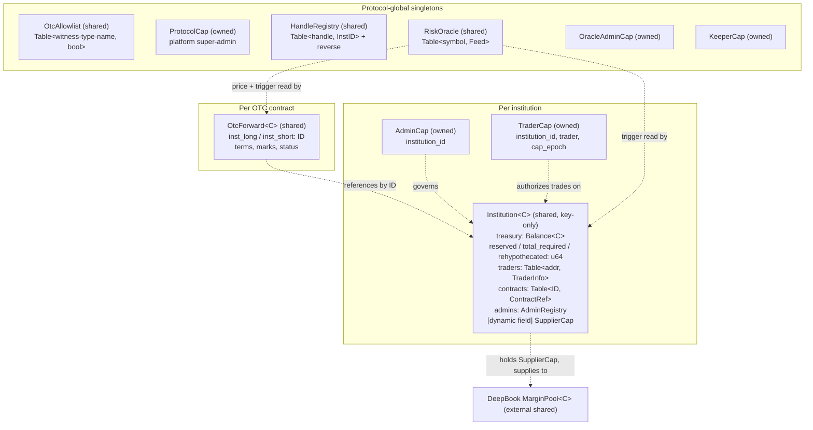
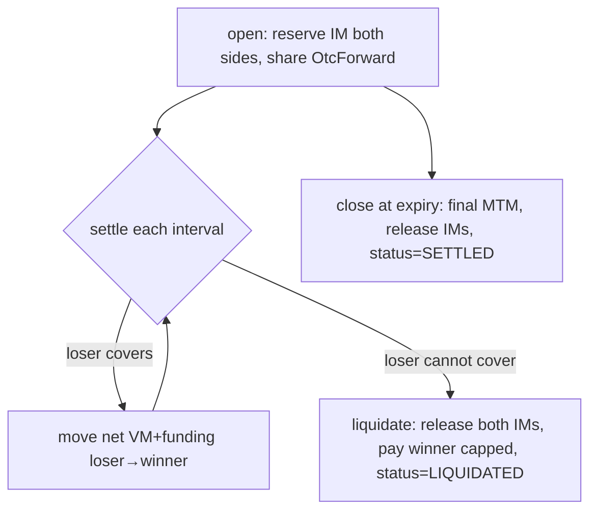

# Fullmetal — Contract Architecture

> Institutional OTC derivatives on Sui with **risk-responsive collateral
> rehypothecation**. Posted margin is supplied into DeepBook's margin (lending)
> pool to earn yield, and recalled automatically when a volatility trigger
> fires. USDC-settled (DBUSDC on testnet, 6 decimals).
>
> **This is a living document.** Update it whenever the contract architecture
> changes. Last updated: 2026-06-16. See the [Change log](#change-log) at the end.

---

## 1. Thesis in one paragraph

In traditional bilateral derivatives, each institution posts collateral that
then sits **idle** with custodians and intermediaries who earn the fees while
the poster earns nothing. Fullmetal keeps that collateral productive: it lives
in one on-chain pool per institution, is **rehypothecated** into DeepBook's
lending pool to earn interest, and is **provably recallable in the same
transaction** the moment risk spikes — something the legacy regime forbids
precisely because, off-chain, you can't verify the collateral is still there.

---

## 2. Module map

The package is `fullmetal` (Move 2024, framework + OZ math + `deepbook_margin`).

| Module | Kind | Responsibility | External deps |
|---|---|---|---|
| `errors` | leaf | One canonical error-code registry (getters) | — |
| `events` | leaf | BCS-stable event schema for the indexer/frontend | — |
| `protocol` | singleton | `ProtocolCap` + `OtcAllowlist` (which OTC witnesses may move margin) | — |
| `registry` | singleton | `HandleRegistry` — unique institution handles | — |
| `institution` | core | One shared pooled-collateral object per tenant; caps; traders; reserved/required accounting; the OTC + rehypo seams | — |
| `settlement` | seam | Hot-potato atomic value transfer between two institutions | — |
| `oracle` | singleton | Keeper-pushed prices + volatility trigger | — |
| `rehypo` | integration | Supply/recall institution collateral ↔ DeepBook margin pool | `deepbook_margin` |
| `otc_forward` | product | Bilateral forward contract object; MTM, funding, liquidation | OZ `fp_math`, `math` |

```
errors ── events
   │         │
   ├── protocol (OtcAllowlist, ProtocolCap)
   ├── registry (HandleRegistry)
   ├── institution ◄──────── settlement
   │       ▲   ▲
   │       │   └────────────── rehypo ──► deepbook_margin (MarginPool / SupplierCap)
   │       │
   │     oracle ──► otc_forward ──► OZ fp_math (SD29x9) + math (mul_div)
```

---

## 3. Object model

What is an **object** (has `key`, lives on-chain with an ID), what is **owned**
vs **shared**, and what is a plain struct/field.



Key choices (evidence in [§10](#10-design-decisions)):

- **Collateral is one pooled `Balance<C>` in the shared `Institution`** — never
  per-position. This is the DeepBook `BalanceManager` pattern and is what makes
  cross-margin possible.
- **`Institution` is `key`-only (no `store`)** → it can only ever be shared, never
  wrapped or stolen, and can be mutated permissionlessly (liquidation, recall).
- **Capabilities are objects** (`AdminCap`/`TraderCap`/`ProtocolCap`/keeper caps),
  ID-bound and revocable — not address→role mappings.
- **An OTC contract is its own shared object** (bilateral, bespoke), referencing
  both institutions by `ID` — vs. a standardized exchange "position-as-row".
- **The DeepBook `SupplierCap` lives as a dynamic field on the institution**, so
  the institution itself is the lender while the core module stays DeepBook-free.

---

## 4. Capabilities & authorization

| Cap | Ability | Holder | Authorizes |
|---|---|---|---|
| `ProtocolCap` | key, store | platform | allowlist/kill OTC witnesses |
| `AdminCap` | key, store | institution admin(s) | treasury in/out, grant/revoke traders, pause, rehypothecate/recall |
| `TraderCap` | key, store | a trader | open contracts up to `book_size` |
| `OracleAdminCap` | key, store | oracle operator | register feeds, mint keepers, clear triggers |
| `KeeperCap` | key, store | price keeper | push prices |

**Revocation** (caps live in users' wallets, can't be deleted remotely):
- Per-cap: removed from the institution's `live_*_caps` VecSet → guard fails.
- Mass (traders): bump `cap_epoch`; every existing `TraderCap` fails the epoch check (O(1)).

**Cross-package seam (witness pattern).** The `otc_forward` and `rehypo`
modules are separate from `institution`, so they can't use `public(package)`.
They authorize via a `drop` **witness** type that only their own module can
construct, checked against the protocol `OtcAllowlist`. `otc_forward`'s witness
is `OtcWitness`; the `ProtocolCap` holder must allowlist its type-name once at
deploy. `reserve_margin` additionally requires the trader's own `&TraderCap`
(double gate: "an allowed OTC package is calling" **and** "this trader
authorized it"). The witness type-name is recorded in `ContractRef` so **only
the package that reserved a contract can release it**.

---

## 5. Data structures — what is tracked where

| Table / field | Lives in | Key → Value | Purpose |
|---|---|---|---|
| `HandleRegistry.handles` | registry (shared) | `String → ID` | unique institution handle → object ID |
| `HandleRegistry.reverse` | registry (shared) | `ID → String` | display / reverse lookup |
| `OtcAllowlist.witnesses` | protocol (shared) | `ascii::String → bool` | OTC/rehypo witness type-names trusted to move margin |
| `Institution.traders` | institution (shared) | `address → TraderInfo` | per-trader `{book_size, deployed, withdraw_permission, active, cap_id}` |
| `Institution.contracts` | institution (shared) | `ID → ContractRef` | per-contract `{trader, counterparty, im_reserved, maintenance_required, open, witness}` — the cross-margin requirement ledger |
| `Institution.live_trader_caps` | institution (shared) | `VecSet<ID>` | which TraderCaps are valid |
| `AdminRegistry.live_admin_caps` | institution (shared) | `VecSet<ID>` | which AdminCaps are valid |
| `RiskOracle.feeds` | oracle (shared) | `String → Feed` | per-symbol price + trigger state |
| `SupplierCap` | dynamic field on `Institution.id` | — | the institution's DeepBook lending position handle |

`Institution` scalar state: `treasury: Balance<C>`, `reserved: u64`,
`total_required: u64`, `rehypothecated: u64`, `cap_epoch: u64`, `paused: bool`,
`handle`, `suins_name: Option<String>`, `rehypo_cap: Option<ID>`.

---

## 6. The accounting model (the heart)

Single pooled balance, with **encumbrance tracked as integer overlays** — funds
are reserved, not physically moved into per-contract escrows.

```
equity   E = balance(treasury) + rehypothecated      (assets we control, liquid + in DeepBook)
reserved R = Σ ContractRef.im_reserved               (initial margin encumbrance)
required M = Σ ContractRef.maintenance_required       (= 0.70 · IM per contract)

available (economic free)   = saturating(E − R)       ← withdraw & reserve gate on this
liquid (physical)           = balance(treasury)       ← physical withdrawal also bounded by this
health                      = E / M                   (computed on demand, never stored)
```

Three zones (the VM-into-buffer model):

```
E ≥ R          healthy   → can withdraw excess (E − R); VM lands in free funds, claimable
M ≤ E < R      buffer    → no withdrawals; VM eats the IM cushion
E < M          liquidate → close out, release IMs, pay winner from what's recoverable
```

**Why `available` is saturating + double-gated:** once reserved IM is supplied
into DeepBook, `balance(treasury)` drops below `reserved`. `available` counts
`rehypothecated` so the economic figure stays correct, but a physical withdrawal
is additionally capped by the liquid balance — you must `recall` first to
liquefy. (This is the audited-OZ "don't let saturating-sub mask a broken
invariant" discipline applied.)

---

## 7. Oracle — what it tracks

A keeper-pushed price book. Per symbol (`Feed`):

| Field | Meaning |
|---|---|
| `price` | current price, `PRICE_SCALE = 1e6` (USD, 6 dp) |
| `prev_price` | price before the last push (for the jump calc) |
| `last_update_ms` | timestamp of last push |
| `jump_threshold_bps` | latch the trigger if `|Δ|/prev` exceeds this |
| `triggered` | **sticky** — true until an admin clears it |

`push_price` recomputes `jump_bps = |new − prev|·10000/prev` and latches
`triggered` when it exceeds the threshold. The demo **crash button** is the
keeper pushing a far-off price → `triggered = true` → permissionless
`recall_on_trigger` becomes callable. (Pyth pull-oracle integration is the
stretch upgrade; Pyth is already available transitively via `deepbook_margin`.)

---

## 8. Capital flow

```mermaid
flowchart LR
    A[Admin wallet] -->|deposit_treasury| T[(Institution treasury\nBalance&lt;C&gt;)]
    T -->|rehypothecate \(admin\)| MP[(DeepBook MarginPool\nearns interest)]
    MP -->|recall \(admin\) / recall_on_trigger \(anyone\)| T
    T -. reserve_margin .-> R{{reserved += IM}}
    OF[OtcForward.settle] -->|VM loser→winner| T2[(Counterparty treasury)]
    T -->|VM loser→winner| T2
    OR[RiskOracle trigger] -->|fires| MP
    style MP fill:#eef
    style T fill:#efe
```

1. **Deposit** — admin funds the treasury.
2. **Reserve** — opening a contract encumbers IM (`reserved += IM`); no funds move.
3. **Rehypothecate** — admin supplies idle/posted collateral into the DeepBook
   margin pool; `balance` drops, `rehypothecated` rises, `equity` unchanged.
4. **Earn** — `supplied_value()` reads the live position (principal + interest).
5. **Settle (MTM)** — each interval, net VM+funding moves loser→winner's free pool.
6. **Recall** — admin anytime, or **anyone** when the oracle trigger latches
   (risk-responsive auto-deleverage). Funds return to liquid balance.
7. **Liquidate** — if a loser can't cover, IMs are released and the winner is
   paid from what's recoverable.

---

## 9. Lifecycle flows

### Onboarding
```
create_institution(handle) ──► shares Institution<C>, returns AdminCap
  admin: deposit_treasury, grant_trader(book_size), set_withdraw_permission,
         add_admin / propose+accept admin transfer, pause/unpause
```

### Rehypothecation (the "send money to DeepBook + recall" loop)
```
rehypothecate(amount)                 recall(amount) / recall_on_trigger(symbol)
  mint SupplierCap (first use)          withdraw amount from MarginPool
  split amount from treasury            join back into treasury
  margin_pool::supply(...)              note_recalled(amount)
  note_supplied(amount)
```

### OTC forward


---

## 10. RFQ & contract finalization — current state and the gap

**This is the most important open item, and the answer to "how is IM escrowed
after RFQ".**

### How it works *today* (no RFQ module yet)
`otc_forward::open(...)` is a **single atomic transaction** that takes *both*
institutions and *both* `TraderCap`s, and:
1. reserves IM on each side via `institution::reserve_margin` — i.e. IM is
   **escrowed by reservation**: each institution's `reserved` counter goes up,
   but the collateral **never leaves its own pool**. There is no separate escrow
   object holding the funds; the contract object holds only the *amount* and the
   terms.
2. creates and shares the `OtcForward` object.

Finalization is **atomic**: if either side's reservation fails (revoked trader,
over book size, insufficient `available`), the whole transaction aborts and no
contract exists. There is no separate "finalize" step.

**The gap:** this requires *both* parties to authorize in *one* PTB (both
TraderCaps present). That models two desks co-signing, not an async RFQ where A
requests quotes, several institutions respond, and A later accepts one.

### How RFQ *will* work (to be built — see §12)
An async flow with a quote object:
```
A: post_rfq(terms, A's TraderCap)         → shared Rfq object (A's side intent recorded)
B,C…: submit_quote(rfq, price, B's cap)    → Quote children (each a firm offer)
A: accept_quote(rfq, quote)                → atomically: reserve IM on A and on the
                                             quoting institution, then otc_forward::open
```
IM is still **escrowed by reservation at accept time** (same mechanism), just
reached through a multi-step negotiation. The accept transaction is the atomic
finalization — it either reserves both IMs and opens the contract, or aborts.
(Open question to settle when building: whether a quote should *pre-reserve* the
quoter's IM when submitted, so an accepted quote can't fail for lack of funds.)

---

## 11. Design decisions (with evidence)

| Decision | Choice | Why |
|---|---|---|
| Collateral layout | One pooled `Balance<C>` per institution; positions are records, not objects | DeepBook `BalanceManager`/`MarginManager` and PREDICT all pool collateral in one object; none make a position a standalone object |
| Contract representation | OTC contract = its own shared object | Bilateral & bespoke (vs standardized exchange positions); mirrors PREDICT's shared `ExpiryMarket` |
| Per-institution roles | Capability objects + allowlists | OZ `access_control` is one-registry-per-module (OTW) — can't be per-tenant; our caps add epoch+VecSet revocation |
| Cross-margin risk | Reservation **sum** now; risk **netting** deferred | DeepBook Margin itself forbids true multi-pool cross-margin (`ECannotHaveLoanInMoreThanOneMarginPool`) — netting is genuinely hard |
| Health metric | Computed on demand, never stored | `MarginManager.risk_ratio()` is a pure view; only events store a ratio |
| Signed PnL | OZ `fp_math` `SD29x9` | Move has no signed ints; audited fixed-point is the right tool |
| Safe arithmetic | OZ `math::u128::mul_div` + rounding | overflow-safe `a·b/c`, audited |
| Institution ID | On-chain `HandleRegistry`, not SuiNS | SuiNS has no Move-callable registration, its target is mutable, costs SUI per name |
| Cross-package auth | `drop` witness + ProtocolCap allowlist | no admin power leaks to the OTC/rehypo packages; ProtocolCap is the kill-switch |

---

## 12. OZ + DeepBook integration

- **OZ libraries (git, audited v1.2.0):** `openzeppelin_math` (`u128::mul_div`,
  `rounding`, `decimal_scaling`) and `openzeppelin_fp_math` (`SD29x9` signed,
  `UD30x9` unsigned, 9-decimal scale). MVR is unavailable on Sui CLI 1.72.1, so
  the git form is used.
- **Decimal bridge:** `fp_math` is hardwired to 9 decimals; DBUSDC is 6. Lift a
  1e6-scaled int into the 9dp domain with `ud30x9::wrap(x · 1000)`; for a
  non-negative `SD29x9`, `unwrap(abs(pnl)) / 1000` gives the 6dp magnitude.
- **DeepBook margin API** (`deepbook_margin::margin_pool`): `mint_supplier_cap`,
  `supply<Asset>(pool, registry, &cap, coin, referral, clock)`,
  `withdraw<Asset>(pool, registry, &cap, Option<amount>, clock, ctx)`,
  `user_supply_amount(pool, cap_id, clock)` — all `public`, no sender checks, so
  a shared object holding the `SupplierCap` is the lender.

### External testnet addresses (for deploy / scripts)
| Thing | Testnet ID |
|---|---|
| DeepBook core pkg | `0x22be4cade64bf2d02412c7e8d0e8beea2f78828b948118d46735315409371a3c` |
| DeepBook margin pkg | `0xd6a42f4df4db73d68cbeb52be66698d2fe6a9464f45ad113ca52b0c6ebd918b6` (orig `0xb8620c…94110e4b`) |
| MarginRegistry | `0x48d7640dfae2c6e9ceeada197a7a1643984b5a24c55a0c6c023dac77e0339f75` |
| DBUSDC margin pool | `0xf08568da93834e1ee04f09902ac7b1e78d3fdf113ab4d2106c7265e95318b14d` |
| DBUSDC coin type | `0xf7152c…::DBUSDC::DBUSDC` (6 dp) |
| OZ math (testnet) | `0x6ad7f3ef1086b951bd51ef9439cf67e89561c0c631c2ce7495a217612f9c6fc1` |
| OZ fp_math (testnet) | `0x9f5aef…0943a78b` (orig `0xd7cade…58c01cb36f`) |

---

## 13. Deployment status & dependency note

The package **builds and unit-tests pass** (8 tests; run via `contracts/run-tests.sh`,
which sets aside the DeepBook dep — `deepbook_margin`'s own tests can't compile
as a dependency). **Publishing to testnet is currently blocked**: the deepbookv3
packages (`deepbook`, `deepbook_margin`) and `pyth`/`wormhole` ship no
`Published.toml`/lock publish records at the pinned revs, so the linker can't
find their on-chain testnet addresses (`PublishUpgradeMissingDependency`). OZ
ships `Published.toml` and resolves fine. **Resolution (next task):** supply
each missing dep's testnet `published-at` + `original-id` (gathered above) as
publish records and publish with `--skip-dependency-verification`, after
confirming the deployed packages' API matches the pinned source.

---

## 14. Deferred / roadmap (contract side)

- **RFQ module** — async quote→accept flow (see §10). *Biggest gap.*
- **Resolve testnet publish** — dependency address records (§13), then the live
  50-DBUSDC supply→recall demo.
- **Cross-margin risk netting** — offset longs/shorts into one health number
  (currently a reservation sum); a standalone computed-view engine over `contracts`.
- **Trader-initiated withdrawal** — `withdraw_permission` is stored but no
  trader-signed withdraw entry yet.
- **Pyth oracle** — replace/augment the keeper oracle with Pyth pull updates.
- **ISDA-style grace/notice** before close-out; **maker/checker** on treasury moves.
- **Partial-recall handling** under DeepBook withdrawal rate limits (mainnet).

---

## Change log

| Date | Change |
|---|---|
| 2026-06-16 | Initial architecture: onboarding (institution/protocol/registry/settlement), oracle, rehypo (DeepBook), otc_forward. 8 tests pass. Deploy blocked on dependency publish records. |
