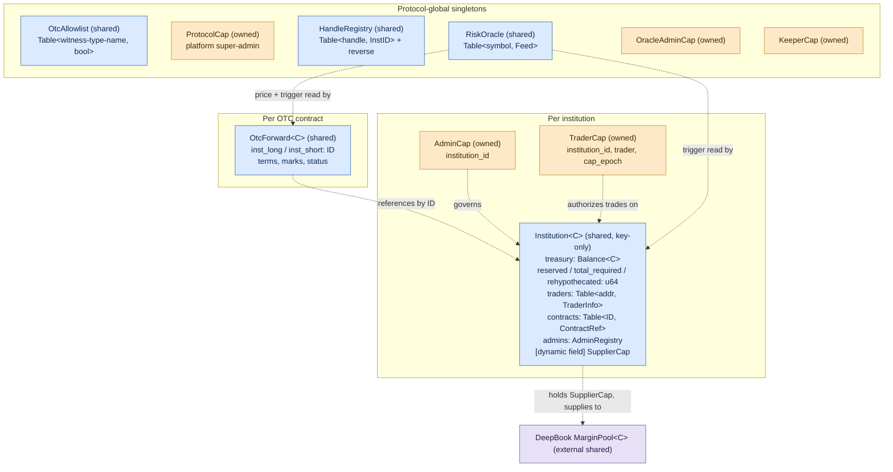
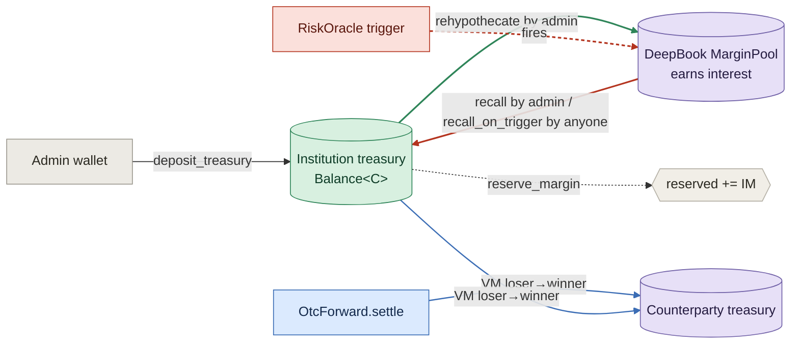
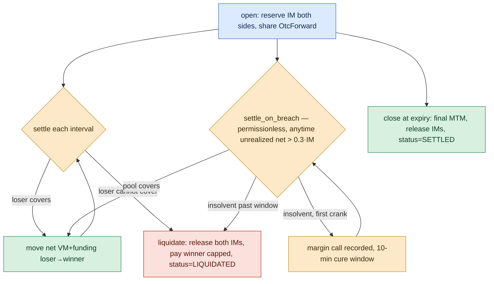

# Fullmetal — Contract Architecture

> Institutional OTC derivatives on Sui with **risk-responsive collateral
> rehypothecation**. Posted margin is supplied into DeepBook's margin (lending)
> pool to earn yield, and recalled automatically when a volatility trigger
> fires. USDC-settled (DBUSDC on testnet, 6 decimals).
>
> **This is a living document.** Update it whenever the contract architecture
> changes. Last updated: 2026-07-08.

---

## 1. Thesis in one paragraph

In traditional bilateral derivatives, each institution posts collateral that
then sits **idle** with custodians and intermediaries who earn the fees while
the poster earns nothing. Fullmetal keeps that collateral productive: it lives
in one on-chain pool per institution, is **rehypothecated** into DeepBook's
lending pool to earn interest, and is **provably recallable in the same
transaction** the moment risk spikes — something the legacy regime forbids
precisely because, off-chain, you can't verify the collateral is still there.

---

## 2. Module map

The package is `fullmetal` (Move 2024, framework + OZ math + `deepbook_margin`).

| Module | Kind | Responsibility | External deps |
|---|---|---|---|
| `errors` | leaf | One canonical error-code registry (getters) | — |
| `events` | leaf | BCS-stable event schema for the indexer/frontend | — |
| `protocol` | singleton | `ProtocolCap` + `OtcAllowlist` (which OTC witnesses may move margin) | — |
| `registry` | singleton | `HandleRegistry` — unique institution handles | — |
| `institution` | core | One shared pooled-collateral object per tenant; caps; traders; reserved/required accounting; the OTC + rehypo seams | — |
| `settlement` | seam | Hot-potato atomic value transfer between two institutions | — |
| `oracle` | singleton | Keeper-pushed prices + volatility trigger | — |
| `rehypo` | integration | Supply/recall institution collateral ↔ DeepBook margin pool | `deepbook_margin` |
| `otc_forward` | product | Bilateral forward contract object; MTM, funding, liquidation; the `open_from_rfq` + `RfqWitness` seam | OZ `fp_math`, `math` |
| `rfq` | product | Request-for-quote: firm collateral-backed quotes → atomic single-signer accept | — |
| `direct` | product | Direct bilateral offer ("type the counterparty's org ID"): proposer fixes all terms + commits collateral first → named desk accepts. Mirror of `rfq`, reuses `open_from_rfq`/`RfqWitness` | — |
| `rfq_twoway` | product | Information-disciplined RFQ ([WHITEPAPER §5.1](WHITEPAPER.md) Phase A): no direction on the request, bid+ask two-way quotes, single-shot per maker, size-bucket ceilings, lean events (ids + expiries; open also carries the underlying — no prices, sides, sizes, or counterparty identities). Reuses `RfqWitness`/`open_from_rfq`; supersedes `rfq` at frontend cutover | — |
| `rehypo_router` | core | Venue-agnostic rehypothecation: admin-tunable `RehypoConfig` (margin bps, liquidity floor, per-venue enable/cap/weight), per-venue receipt + principal dynamic-field slots, hot-potato supply/recall tickets for **external** venue adapter packages (Suilend / Navi) | — |

```
errors ── events
   │         │
   ├── protocol (OtcAllowlist, ProtocolCap)
   ├── registry (HandleRegistry)
   ├── institution ◄──────── settlement
   │       ▲   ▲   ▲
   │       │   │   └────────── rehypo ──► deepbook_margin (MarginPool / SupplierCap)
   │       │   └────────────── rehypo_router ──► external venue adapters (PTB tickets)
   │       │
   │     oracle ──► otc_forward ──► OZ fp_math (SD29x9) + math (mul_div)
   │   (EWMA vol)       ▲   ▲   ▲
   │                  rfq  direct  rfq_twoway   (all reuse open_from_rfq + RfqWitness)
```

---

## 3. Object model

What is an **object** (has `key`, lives on-chain with an ID), what is **owned**
vs **shared**, and what is a plain struct/field.



Key choices (evidence in [§10](#10-design-decisions)):

- **Collateral is one pooled `Balance<C>` in the shared `Institution`** — never
  per-position. This is the DeepBook `BalanceManager` pattern and is what makes
  cross-margin possible.
- **`Institution` is `key`-only (no `store`)** → it can only ever be shared, never
  wrapped or stolen, and can be mutated permissionlessly (liquidation, recall).
- **Capabilities are objects** (`AdminCap`/`TraderCap`/`ProtocolCap`/keeper caps),
  ID-bound and revocable — not address→role mappings.
- **An OTC contract is its own shared object** (bilateral, bespoke), referencing
  both institutions by `ID` — vs. a standardized exchange "position-as-row".
- **The DeepBook `SupplierCap` lives as a dynamic field on the institution**, so
  the institution itself is the lender while the core module stays DeepBook-free.

---

## 4. Capabilities & authorization

| Cap | Ability | Holder | Authorizes |
|---|---|---|---|
| `ProtocolCap` | key, store | platform | allowlist/kill OTC witnesses |
| `AdminCap` | key, store | institution admin(s) | treasury in/out, grant/revoke traders, pause, rehypothecate/recall |
| `TraderCap` | key, store | a trader | open contracts up to `book_size` |
| `OracleAdminCap` | key, store | oracle operator | register feeds, mint keepers, clear triggers |
| `KeeperCap` | key, store | price keeper | push prices |

**Revocation** (caps live in users' wallets, can't be deleted remotely):
- Per-cap: removed from the institution's `live_*_caps` VecSet → guard fails.
- Mass (traders): bump `cap_epoch`; every existing `TraderCap` fails the epoch check (O(1)).

**Cross-package seam (witness pattern).** The `otc_forward` and `rehypo`
modules are separate from `institution`, so they can't use `public(package)`.
They authorize via a `drop` **witness** type that only their own module can
construct, checked against the protocol `OtcAllowlist`. `otc_forward`'s witness
is `OtcWitness`; the `ProtocolCap` holder must allowlist its type-name once at
deploy. `reserve_margin` additionally requires the trader's own `&TraderCap`
(double gate: "an allowed OTC package is calling" **and** "this trader
authorized it"). The witness type-name is recorded in `ContractRef` so **only
the package that reserved a contract can release it**.

---

## 5. Data structures — what is tracked where

| Table / field | Lives in | Key → Value | Purpose |
|---|---|---|---|
| `HandleRegistry.handles` | registry (shared) | `String → ID` | unique institution handle → object ID |
| `HandleRegistry.reverse` | registry (shared) | `ID → String` | display / reverse lookup |
| `OtcAllowlist.witnesses` | protocol (shared) | `ascii::String → bool` | OTC/rehypo witness type-names trusted to move margin |
| `Institution.traders` | institution (shared) | `address → TraderInfo` | per-trader `{book_size, deployed, withdraw_permission, active, cap_id}` |
| `Institution.contracts` | institution (shared) | `ID → ContractRef` | per-contract `{trader, counterparty, im_reserved, maintenance_required, open, witness}` — the cross-margin requirement ledger |
| `Institution.live_trader_caps` | institution (shared) | `VecSet<ID>` | which TraderCaps are valid |
| `AdminRegistry.live_admin_caps` | institution (shared) | `VecSet<ID>` | which AdminCaps are valid |
| `RiskOracle.feeds` | oracle (shared) | `String → Feed` | per-symbol price + trigger state |
| `SupplierCap` | dynamic field on `Institution.id` | — | the institution's DeepBook lending position handle |

`Institution` scalar state: `treasury: Balance<C>`, `reserved: u64`,
`total_required: u64`, `rehypothecated: u64`, `cap_epoch: u64`, `paused: bool`,
`handle`, `suins_name: Option<String>`, `rehypo_cap: Option<ID>`.

---

## 6. The accounting model (the heart)

Single pooled balance, with **encumbrance tracked as integer overlays** — funds
are reserved, not physically moved into per-contract escrows.

```
equity   E = balance(treasury) + rehypothecated      (assets we control, liquid + in DeepBook)
reserved R = Σ ContractRef.im_reserved               (initial margin encumbrance)
required M = Σ ContractRef.maintenance_required       (= 0.70 · IM per contract)

available (economic free)   = saturating(E − R)       ← withdraw & reserve gate on this
liquid (physical)           = balance(treasury)       ← physical withdrawal also bounded by this
health                      = E / M                   (computed on demand, never stored)
```

Three zones (the VM-into-buffer model):

```
E ≥ R          healthy   → can withdraw excess (E − R); VM lands in free funds, claimable
M ≤ E < R      buffer    → no withdrawals; VM eats the IM cushion
E < M          liquidate → close out, release IMs, pay winner from what's recoverable
```

**Why `available` is saturating + double-gated:** once reserved IM is supplied
into DeepBook, `balance(treasury)` drops below `reserved`. `available` counts
`rehypothecated` so the economic figure stays correct, but a physical withdrawal
is additionally capped by the liquid balance — you must `recall` first to
liquefy. (This is the audited-OZ "don't let saturating-sub mask a broken
invariant" discipline applied.)

---

## 7. Oracle — what it tracks

A keeper-pushed price book. Per symbol (`Feed`):

| Field | Meaning |
|---|---|
| `price` | current price, `PRICE_SCALE = 1e6` (USD, 6 dp) |
| `prev_price` | price before the last push (for the jump calc) |
| `last_update_ms` | timestamp of last push |
| `jump_threshold_bps` | latch the trigger if `|Δ|/prev` exceeds this |
| `triggered` | **sticky** — true until an admin clears it |

`push_price` recomputes `jump_bps = |new − prev|·10000/prev` and latches
`triggered` when it exceeds the threshold. The demo **crash button** is the
keeper pushing a far-off price → `triggered = true` → permissionless
`recall_on_trigger` becomes callable. (Pyth pull-oracle integration is the
stretch upgrade; Pyth is already available transitively via `deepbook_margin`.)

**EWMA volatility layer (additive upgrade).** `enable_vol` arms a per-symbol
`VolState` (a dynamic field on the oracle — `Feed`'s layout is upgrade-frozen)
and `push_price_v2` = `push_price` + one integer multiply-add:
`var ← (λ·var + (1−λ)·r²)/1e4`, all in bps². Two latches — a **shock**
(`z = |r|/σ_prev > z*`, default 4σ) and a **regime ceiling** (`σ > σ_ceil`) —
and an asymmetric release: σ must decay below `θ_rel·σ_ceil` (0.7) for `N`
consecutive in-band prints, any out-of-band print resetting the counter. A
larger shock therefore earns a longer cool-down with no extra rule. Feeds
without vol state behave exactly as before, so keepers switch to v2
unconditionally. Views: `vol_bps`, `has_vol`, `release_progress`. The math and
its calibration anchors are derived in
[RISK-RESPONSIVE-REHYPOTHECATION.md](RISK-RESPONSIVE-REHYPOTHECATION.md) §1.

---

## 8. Capital flow



1. **Deposit** — admin funds the treasury.
2. **Reserve** — opening a contract encumbers IM (`reserved += IM`); no funds move.
3. **Rehypothecate** — admin supplies idle/posted collateral into the DeepBook
   margin pool; `balance` drops, `rehypothecated` rises, `equity` unchanged.
4. **Earn** — `supplied_value()` reads the live position (principal + interest).
5. **Settle (MTM)** — each interval, net VM+funding moves loser→winner's free pool.
6. **Recall** — admin anytime, or **anyone** when the oracle trigger latches
   (risk-responsive auto-deleverage). Funds return to liquid balance.
7. **Liquidate** — if a loser can't cover, IMs are released and the winner is
   paid from what's recoverable.

---

## 9. Lifecycle flows

### Onboarding
```
create_institution(handle) ──► shares Institution<C>, returns AdminCap
  admin: deposit_treasury, grant_trader(book_size), set_withdraw_permission,
         add_admin / propose+accept admin transfer, pause/unpause
```

### Rehypothecation (the "send money to DeepBook + recall" loop)
```
rehypothecate(amount)                 recall(amount) / recall_on_trigger(symbol)
  mint SupplierCap (first use)          withdraw amount from MarginPool
  split amount from treasury            join back into treasury
  margin_pool::supply(...)              note_recalled(amount)
  note_supplied(amount)
```

### Venue-agnostic rehypothecation (rehypo_router — Suilend / Navi path)
External venue adapters cannot touch `treasury_mut`/`note_supplied`
(`public(package)`), so the router exposes a public hot-potato seam. The
tickets have no `drop`: a PTB that debits the treasury and fails to complete
the deposit aborts whole.
```
supply:  (coin, ticket) = withdraw_for_rehypo(inst, cap, venue, amt)   // floor F + venue-cap asserts
         receipt        = <venue adapter>::supply(coin, …)             // typed venue call
         confirm_rehypo(inst, ticket, Some(receipt))                    // store receipt + note_supplied
recall:  (receipt, t2)  = begin_recall<R>(inst, cap, venue)
         coin            = <venue adapter>::recall(receipt, …)
         finish_recall(inst, t2, coin)                                  // rejoin + note_recalled
```
`withdraw_for_rehypo` enforces the liquidity floor `T − amount ≥ F` where
`F = max(stress_floor, phi_bps·reserved)` — the
[risk doc §2](RISK-RESPONSIVE-REHYPOTHECATION.md) invariant; the keeper
proposes `stress_floor`, the chain enforces it. Config, receipts, and
per-venue principals all live in dynamic fields (no `Institution` struct
change). Receipt types per venue: DeepBook `SupplierCap` (reused), Suilend
`Coin<CToken>` (consumed on redeem), Navi `AccountCap` (reused) — round-trips
validated against live mainnet in `scripts/` (see [scripts/README.md](scripts/README.md)).

### OTC forward


The **maintenance-breach crank** (`settle_on_breach`) is what makes
cross-margining real: a breached-but-solvent position is cured by the pooled
treasury with zero margin-call latency and survives; an insolvent breach must
persist through an on-chain margin call (`MarginCalled`, `CURE_WINDOW_MS` =
10 min) before it may liquidate — a one-print wick that mean-reverts cannot
kill a position (anti wick-picking, confirmed and fixed in adversarial
review). Funding accrues **pro-rata in elapsed time**, so crank sequences
telescope to exactly the single-settlement charge. The firm-cash breach
(equity < Σ maintenance) is structurally unreachable — payments are capped at
`available`, so equity never drops below Σ reserved IM; unrealized loss is
the only quantity that can outrun the fences, and the crank polices it.
Views for keepers/UI: `mm_buffer`, `mm_breached`, `margin_call_deadline`.

---

## 10. RFQ — async request → firm quote → single-signer accept (BUILT)

The `rfq` module is the **answer to "how is IM escrowed after RFQ"** and resolves
the one hard problem: `otc_forward::open` needs *both* desks' `TraderCap`s in one
transaction, but RFQ is inherently async. The design (chosen after studying
Variational Pro, Paradigm, 0x, Hashflow) is **on-chain firm quotes** — and it
deliberately **drops last-look** (a TradFi FX artifact that's hostile to a
trust-minimized chain): a maker can *pull* a quote, but can't renege after it's
accepted.

```
open_rfq (requester)        → shared Rfq<C>          [no margin locked; targets = maker IDs or broadcast]
submit_quote (maker signs)  → shared Quote<C> + maker IM FIRM-reserved
                              under RfqWitness, keyed by the Quote id   [maker can now go offline]
  withdraw_quote / reclaim  → release the firm IM                       [pull / permissionless cleanup]
accept_quote (REQUESTER only) → otc_forward::open_from_rfq:
                                • reserve requester IM (live cap, OtcWitness)
                                • RE-KEY maker IM  quote_id→otc_id, RfqWitness→OtcWitness
                                • share OtcForward<C>                   [both sides bound, ONE signer]
… then the deployed settle / close / liquidation run UNCHANGED.
```

**The async-open resolution.** The maker commits at *quote* time (it co-signs
`submit_quote` with its own cap, firm-reserving IM — `reserve_margin` enforces
`deployed + im ≤ book_size` and `im ≤ available`, so a maker physically can't
publish a quote it can't back). `accept_quote` is signed by the **requester
alone**: it reserves the requester leg with the live requester cap, then
`rekey_reservation` relabels the maker's existing reservation onto the fresh
contract id and swaps its witness `RfqWitness → OtcWitness` — a pure accounting
relabel (no counter changes, magnitudes asserted equal), so no maker
co-signature and no maker fade. IM is still **escrowed by reservation**, never
moved.

**Asymmetric commitment, by design:** the maker (whose price must be trustworthy)
locks firm collateral when it quotes; the requester commits nothing until the
single accept tx it signs. A maker's firm-quote lockup is bounded by the quote
TTL via permissionless `reclaim_expired_quote`.

`RfqWitness` lives in `otc_forward` (not `rfq`) so the module dependency is
one-way (`rfq → otc_forward`), and is allowlisted by `ProtocolCap` like
`OtcWitness`. *Deferred seam:* off-chain ed25519-signed quotes (Paradigm/0x
style) for streaming scale, reusing `open_from_rfq` verbatim.

---

## 10b. Direct offer — "type the counterparty's org ID" (BUILT)

For a trader who already knows its counterparty and the terms, the `direct`
module skips the competitive auction. It is the **mirror of RFQ** — the *commit
order is flipped* — and reuses `open_from_rfq`/`RfqWitness` with **zero new
settlement code and no new witness to allowlist**.

```
propose_direct (proposer)   → shared DirectOffer<C> + proposer IM FIRM-reserved
                              under RfqWitness, keyed by the offer id   [names ONE counterparty; price FIXED]
  withdraw_direct / reclaim → release the firm IM                       [pull / permissionless cleanup]
accept_direct (COUNTERPARTY only) → otc_forward::open_from_rfq:
                                • reserve acceptor IM (live cap, OtcWitness)
                                • RE-KEY proposer IM  offer_id→otc_id, RfqWitness→OtcWitness
                                • share OtcForward<C>                   [both sides bound, ONE signer]
```

| | RFQ | Direct |
|---|---|---|
| Audience | broadcast / N targets | exactly one named `counterparty_inst` |
| Price | makers compete | fixed by proposer |
| Commits collateral first | the responder (maker) | the initiator (proposer) |
| Live signer at open | requester | counterparty |
| Escape hatches | `withdraw_quote` / `reclaim_expired_quote` | `withdraw_direct` / `reclaim_expired_direct` |

In `accept_direct`, only the institution whose `object::id` equals
`offer.counterparty_inst` can accept, and the proposer plays `open_from_rfq`'s
"maker"/pre-committed role while the acceptor plays the "requester"/live role —
so the same re-key seam binds both legs under a single signer. Money-safety is
identical to RFQ: a live offer always frees via the proposer's pull or the
permissionless TTL reclaim.

---

## 10c. Two-way RFQ — information-disciplined price formation (BUILT)

`rfq_twoway` is Phase A of the leakage design in
[WHITEPAPER §5.1](WHITEPAPER.md): the original `rfq` broadcasts, in plaintext,
everything an adversary needs to front-run the winner's hedge (direction,
notional, limit band, every maker's live price with identity). The two-way
module keeps the exact firm-quote machinery — maker IM reserved at quote time
under `RfqWitness`, no last look, single-signer accept via `open_from_rfq` —
and removes the leaks:

```
open_two_way            NO side field; bucket CEILING instead of exact notional; no price band
submit_two_way_quote    maker posts BID and ASK (crossed markets abort); ONE shot per maker
                        per RFQ — withdrawing frees the IM bond but never restores the shot
accept_two_way          requester picks the side (take_ask) + exact notional (≤ ceiling)
                        — direction exists nowhere on-chain before this call
events                  ids + expiries (+ underlying & a targeted flag on open); NO
                        prices, sides, sizes, or counterparty identities
```

One IM reservation backs the two-way quote because only one side can ever
execute. Counterparty identity stays readable on the shared objects (makers
need it for credit) but leaves the indexed event stream. Post-trade,
`ContractOpened` still discloses terms — sealing that is Phase C
(Seal/Walrus). New abort codes: `ECrossedQuote` (105), `EAlreadyQuoted` (106),
`EOverBucket` (107). `rfq` remains deployed and drives the current demo;
the frontend cutover retires it.

---

## 11. Design decisions (with evidence)

| Decision | Choice | Why |
|---|---|---|
| Collateral layout | One pooled `Balance<C>` per institution; positions are records, not objects | DeepBook `BalanceManager`/`MarginManager` and PREDICT all pool collateral in one object; none make a position a standalone object |
| Contract representation | OTC contract = its own shared object | Bilateral & bespoke (vs standardized exchange positions); mirrors PREDICT's shared `ExpiryMarket` |
| Per-institution roles | Capability objects + allowlists | OZ `access_control` is one-registry-per-module (OTW) — can't be per-tenant; our caps add epoch+VecSet revocation |
| Cross-margin risk | Reservation **sum** now; risk **netting** deferred | DeepBook Margin itself forbids true multi-pool cross-margin (`ECannotHaveLoanInMoreThanOneMarginPool`) — netting is genuinely hard |
| Health metric | Computed on demand, never stored | `MarginManager.risk_ratio()` is a pure view; only events store a ratio |
| Signed PnL | OZ `fp_math` `SD29x9` | Move has no signed ints; audited fixed-point is the right tool |
| Safe arithmetic | OZ `math::u128::mul_div` + rounding | overflow-safe `a·b/c`, audited |
| Institution ID | On-chain `HandleRegistry`, not SuiNS | SuiNS has no Move-callable registration, its target is mutable, costs SUI per name |
| Cross-package auth | `drop` witness + ProtocolCap allowlist | no admin power leaks to the OTC/rehypo packages; ProtocolCap is the kill-switch |

---

## 12. OZ + DeepBook integration

- **OZ libraries (git, audited v1.2.0):** `openzeppelin_math` (`u128::mul_div`,
  `rounding`, `decimal_scaling`) and `openzeppelin_fp_math` (`SD29x9` signed,
  `UD30x9` unsigned, 9-decimal scale). The OZ deps use the git form (pinned to the
  audited v1.2.0 tag); `deepbook_margin` resolves via MVR (see §13).
- **Decimal bridge:** `fp_math` is hardwired to 9 decimals; DBUSDC is 6. Lift a
  1e6-scaled int into the 9dp domain with `ud30x9::wrap(x · 1000)`; for a
  non-negative `SD29x9`, `unwrap(abs(pnl)) / 1000` gives the 6dp magnitude.
- **DeepBook margin API** (`deepbook_margin::margin_pool`): `mint_supplier_cap`,
  `supply<Asset>(pool, registry, &cap, coin, referral, clock)`,
  `withdraw<Asset>(pool, registry, &cap, Option<amount>, clock, ctx)`,
  `user_supply_amount(pool, cap_id, clock)` — all `public`, no sender checks, so
  a shared object holding the `SupplierCap` is the lender.

### External testnet addresses (for deploy / scripts)
| Thing | Testnet ID |
|---|---|
| DeepBook core pkg | `0x22be4cade64bf2d02412c7e8d0e8beea2f78828b948118d46735315409371a3c` |
| DeepBook margin pkg | `0xd6a42f4df4db73d68cbeb52be66698d2fe6a9464f45ad113ca52b0c6ebd918b6` (orig `0xb8620c…94110e4b`) |
| MarginRegistry | `0x48d7640dfae2c6e9ceeada197a7a1643984b5a24c55a0c6c023dac77e0339f75` |
| DBUSDC margin pool | `0xf08568da93834e1ee04f09902ac7b1e78d3fdf113ab4d2106c7265e95318b14d` |
| DBUSDC coin type | `0xf7152c…::DBUSDC::DBUSDC` (6 dp) |
| OZ math (testnet) | `0x6ad7f3ef1086b951bd51ef9439cf67e89561c0c631c2ce7495a217612f9c6fc1` |
| OZ fp_math (testnet) | `0x9f5aef…0943a78b` (orig `0xd7cade…58c01cb36f`) |

---

## 13. Deployment — LIVE on testnet

The package **builds, unit-tests pass** (40 tests; see
[contracts/README.md](contracts/README.md) for the toolchain notes), and is
**deployed to testnet**, with the full rehypothecation loop, the RFQ path, and
the direct-offer path all proven on-chain with real DBUSDC.

> **Deployed vs. built:** the modules added since the last publish —
> `rehypo_router`, `rfq_twoway`, the oracle EWMA layer, and the
> `settle_on_breach` crank — are in-repo, compiled, and fully unit-tested but
> **not yet on testnet**; they ship with the next package upgrade (all changes
> are upgrade-compatible: additive modules/functions/structs only, frozen
> signatures untouched).

**How the dependency-publish hurdle was solved — MVR.** Publishing links against
the deployed DeepBook on testnet; the deepbookv3 source revs ship no publish
records, so the address can only come from an external resolver. The fix was the
**MVR (Move Registry) resolver** (`mvr` binary installed on PATH):
`deepbook_margin = { r.mvr = "@deepbook/margin-trading/13" }` in `Move.toml`.
Note: only **version 13** of that MVR package carries git source (the latest, 14,
does not), so the version is pinned. OZ math stays a git dep (it ships
`Published.toml`).

**Deployed objects (testnet):**

| Object | ID |
|---|---|
| Package (current) | `0x53ed96a991241db1e20c964930f1e9981c2db438f74dc17867f9705bd8b392b0` (upgrade w/ rehypo recall-rounding fix) |
| Package (prev — direct offer) | `0xbbf751ec720828c7ca39efefcd246c43c86e46ae310218a420c00aaf27b5b7fa` |
| Package (prev — RFQ) | `0x7106aeb00de8f07c4f5c28e1fc7b13b03e42e474e6221db81e81b09ca80b561e` |
| Package (original-id) | `0x3dfbfa5254f00a0b501ebfdf449f044340e09f0629b37dfa7d834130157dfddf` |
| UpgradeCap (owner) | `0xbe6518c77007f7fb3940faed2b4b3bf5ec8a6a7fcc653f66eeee548614149fe2` |
| OtcAllowlist (shared) | `0x6adb6cb2a30e37a9255138a56981516f1267d2284fc06f28917034ad7413e68a` |
| HandleRegistry (shared) | `0x1b18463c8e784b709f326787520e313f62eb75485ac2163673720d77eefddcc8` |
| RiskOracle (shared) | `0xac39229ae9e9547582aa607c1bc084b42fd722aa5e74595af16875efcffb4cdd` |
| ProtocolCap (owner) | `0x0b226a0531f0b4436b0c07b4cffaa45a8da64d4e04c8f390a86d950739d03eec` |
| OracleAdminCap (owner) | `0x33adac6f64ae3ecb1af395de98f9a4f0708d1d97f4848a32dc428a7b9e651b87` |
| UpgradeCap (owner) | `0xbe6518c77007f7fb3940faed2b4b3bf5ec8a6a7fcc653f66eeee548614149fe2` |

**Proven loops:**
- `scripts/deploy-test.ts` — create institution → deposit 50 DBUSDC →
  `rehypothecate` into the live DBUSDC margin pool (`0xf08568…`) → register an
  oracle feed + push a crash price (latch the trigger) → `recall_on_trigger`
  pulls the 50 DBUSDC back. Observed: `rehypothecated` 50→0 and liquid treasury
  0→50 across the recall.
- `scripts/two-inst-rfq.ts` — two institutions (Goldwoman ↔ Cumberland), 100
  DBUSDC each: `open_rfq` → `submit_quote` (firm-reserve 20) → `accept_quote`
  opens the OtcForward, single signer. Both legs reserved 20.
- `scripts/two-inst-direct.ts` — same two desks via the **direct** path:
  `propose_direct` (proposer firm-reserves 20) → `accept_direct` by the named
  counterparty opens the OtcForward. Both legs reserved 20.

---

## 14. Deferred / roadmap (contract side)

Built since the original roadmap: ~~MM-breach enforcement~~ (`settle_on_breach`
crank + margin-call cure window, §9), ~~EWMA volatility trigger~~ (§7),
~~venue-agnostic rehypothecation core~~ (`rehypo_router`, §9),
~~information-disciplined RFQ~~ (`rfq_twoway`, §10c), ~~ISDA-style grace before
close-out~~ (the 10-min cure window is exactly this). Still deferred:

- **Off-chain signed quotes** — ed25519-signed maker quotes redeemed on-chain
  (Paradigm/0x style) for streaming scale, reusing `open_from_rfq` (see §10).
- **Sealed-bid quotes** — Seal threshold-encrypted prices on `rfq_twoway`,
  winner decrypted on-chain in `accept_two_way` (WHITEPAPER §5.1 Phase B).
- **Makers competing on funding rate** (not just price), and IM-band negotiation.
- **Firm-level health view** — Σ unrealized across a desk's book (keeper reads
  `mm_breached` per contract today; an on-chain aggregate needs contract marks
  pushed to the institution).
- **Liquidation incentive** — a bounty so third-party cranking of
  `settle_on_breach` is self-funding.
- **Trader-initiated withdrawal** — `withdraw_permission` is stored but no
  trader-signed withdraw entry yet.
- **Pyth oracle** — replace/augment the keeper oracle's *marks* with Pyth pull
  updates (the EWMA/trigger layer sits above whichever mark source).
- **Maker/checker** on treasury moves; **Suilend/Navi typed adapter packages**
  (the PTB round-trips are validated; the Move adapters + allowlisted adapter
  witnesses are the production form).
- **Partial-recall handling** under venue withdrawal limits (Suilend's outflow
  rate limiter, Navi oracle-freshness gating — measured in `scripts/`).
