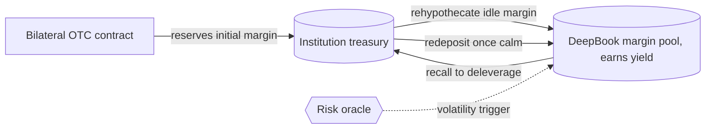

# Fullmetal — the missing collateral efficiency layer for institutional finance

Fullmetal is a contract-execution venue and collateral-management protocol for
institutional **OTC derivatives**. It uses **risk-responsive collateral rehypothecation**
and **cross-margining** to turn idle collateral into a productive primitive — collapsing
the stack of intermediaries that traditional OTC markets depend on into a single protocol.
Settled in USDC on Sui.

> Sui Overflow hackathon MVP — live on **Sui testnet**. Demo: [demo.fullmetal.finance](https://demo.fullmetal.finance)

## Why

Trillions in OTC derivatives collateral sit idle, locked behind up to ten layers of
regulatory intermediaries that each take a fee, compound administrative overhead, and gate
settlement behind manual margin calls and minimum-transfer thresholds. With no shared
ledger or common margining layer, institutions over-post collateral and earn nothing on it.

Fullmetal replaces that stack with one protocol:

- **Collateral stays productive** — posted margin is rehypothecated to yield-bearing
  venues instead of sitting idle.
- **Risk response is automatic and on-chain** — a volatility trigger recalls collateral
  permissionlessly, then redeposits once markets calm.
- **Cross-margining across derivative types** lowers initial-margin requirements, unlocking
  higher risk-adjusted leverage.

A crypto-native design aimed at crypto-first trading desks and smaller firms that would see
meaningful savings over prime brokerage.

## The collateral loop



1. Two desks open a bilateral OTC contract; each posts initial margin, reserved against
   the institution's single pooled treasury (cross-margin, never per-position).
2. Idle initial margin is rehypothecated into the DeepBook USDC margin pool, earning
   supply yield while it backs the position.
3. A risk-oracle volatility trigger makes the recall **permissionless** — collateral
   auto-deleverages back to liquid treasury.
4. When volatility subsides, the recalled margin redeposits to keep earning.

## Repository

A monorepo:

| Path | What |
|---|---|
| `contracts/` | Sui Move package (`fullmetal`) — institutions, OTC forwards (with maintenance-breach liquidation), RFQ + two-way RFQ, direct offers, venue-agnostic rehypothecation, EWMA risk oracle. See [contracts/README.md](contracts/README.md). |
| `frontend/` | Next.js demo app — zkLogin, gasless sponsored transactions, live venue rates + risk reads. See [frontend/README.md](frontend/README.md). |
| `scripts/` | TypeScript deploy utilities + live-mainnet venue validations (Suilend/Navi round-trips). See [scripts/README.md](scripts/README.md). |
| [WHITEPAPER.md](https://github.com/fullmetal-finance/fullmetal-sui-demo/blob/main/WHITEPAPER.md) | The whitepaper — protocol design, mathematics, RFQ information design, production path. |
| [ARCHITECTURE.md](https://github.com/fullmetal-finance/fullmetal-sui-demo/blob/main/ARCHITECTURE.md) | Object model, accounting, capabilities & auth, lifecycle flows — the deep dive. |
| [RISK-RESPONSIVE-REHYPOTHECATION.md](https://github.com/fullmetal-finance/fullmetal-sui-demo/blob/main/RISK-RESPONSIVE-REHYPOTHECATION.md) | The risk algorithm — volatility trigger, liquidity floor, venue allocation, per-venue adapters. |

## What the demo covers

- Institutional desk onboarding via Google sign-in (**zkLogin** — no seed phrase, gasless
  sponsored transactions); admin and trader dashboards.
- OTC contract creation — **direct** (named counterparty) and **RFQ** (competing firm quotes).
- Forwards, perpetuals, and forward-perp hybrids in one contract model (forwards live in
  the demo; perp/hybrid are an expiry + funding parameter change). Any underlying — equities,
  FX, crypto.
- Rehypothecation of posted margin into the **DeepBook** USDC margin pool.
- A live mock-oracle volatility spike that recalls collateral from DeepBook, then
  **redeposits** once the volatility indicator normalises.

Suilend and Navi are wired in as live supply-rate feeds; rehypothecation routing to them is
in progress.

## Setup

The runnable demo is the frontend (full env + structure in [frontend/README.md](frontend/README.md)):

```bash
cd frontend
npm install
npm run dev          # http://localhost:3000  (needs frontend/.env.local)
```

The Move package builds and tests with the [Sui CLI](https://docs.sui.io/guides/developer/getting-started/sui-install)
**≥ 1.74** (`cd contracts && sui move test` — 36 tests; toolchain notes incl. the
pyth test shim in [contracts/README.md](contracts/README.md)). Deployment goes
through the SDK (`scripts/deploy-test.ts`) rather than the CLI — see
ARCHITECTURE.md §12–13 for the MVR and protocol-version details.

## Roadmap (next ~4 months)

- ~~Rehypothecation risk algorithm~~ — designed with verified sources and the core is
  built: EWMA volatility trigger with hysteresis, on-chain liquidity floor,
  venue-agnostic router ([RISK-RESPONSIVE-REHYPOTHECATION.md](https://github.com/fullmetal-finance/fullmetal-sui-demo/blob/main/RISK-RESPONSIVE-REHYPOTHECATION.md)). Next: the keeper allocator.
- ~~Cross-margining enforcement~~ — built: the maintenance-breach settlement crank with
  pooled-treasury grace and a margin-call cure window (WHITEPAPER §4).
- Backtesting across market regimes; capital-efficiency benchmarking vs TradFi and
  crypto OTC (plan in WHITEPAPER §11).
- Real institutional on-ramp.
- Privacy layer for OTC trades — Phase A (two-way RFQ, direction hidden on-chain) is
  built at the contract layer; sealed bids + encrypted logs (**Seal + Walrus**) next
  (WHITEPAPER §5.1).
- AI layer for monitoring rehypothecation-venue activity and dynamically evaluating risk.

## Status

MVP on Sui testnet. The deployed suite (institution, OTC forward, RFQ, direct offer,
DeepBook rehypothecation, oracle) has the full rehypothecate → trigger → recall →
redeposit loop proven on-chain. Since the last publish (shipping with the next
upgrade, all additive): the EWMA risk trigger, the venue-agnostic rehypothecation
router with the liquidity floor, the maintenance-breach liquidation crank, and the
two-way RFQ — 36/36 unit tests. Suilend and Navi supply→recall round-trips are
validated against live mainnet (`scripts/`). Live object IDs in
[ARCHITECTURE.md](https://github.com/fullmetal-finance/fullmetal-sui-demo/blob/main/ARCHITECTURE.md) §13–14.
