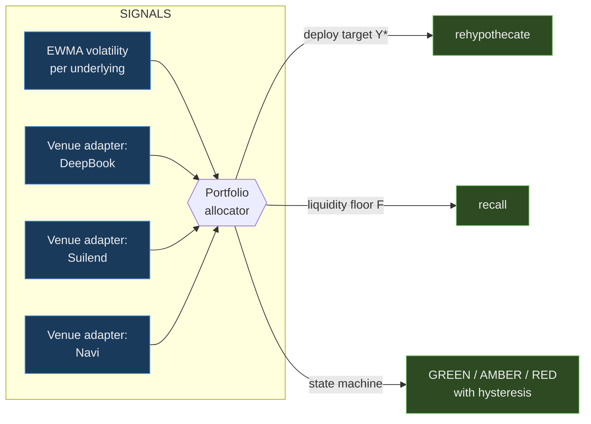

# Risk-Responsive Rehypothecation — the algorithm

How Fullmetal decides **how much** idle margin to rehypothecate, **where** to put it,
**when** to recall it, and **when** to redeposit — one control loop, four formulas,
every input verified against a primary source (all cited inline; source list in §9).

The design steals the *mathematical core* of the two industries that already solve this
problem and none of their process. From TradFi: how to size a liquidity buffer and how to
aggregate independent risk modules. From crypto risk engineering (Gauntlet, Chaos Labs,
Morpho curators): how to parameterize lending-venue risk, why utilization gates
withdrawals, and what actually happened when it did.



**Architecture, up front:** one portfolio-level allocator + an independent risk adapter
per venue. This decomposition has convergent pedigree from both worlds. It is how ISDA
SIMM is built — independent per-bucket risk modules, each locally concentration-penalized,
rolled up by a correlation-aware square-root formula ([SIMM v2.4] ¶6, §K.88). And it is
how DeFi's best allocators are built — a MetaMorpho vault curator sets **absolute and
relative caps per lending market** and a withdraw queue over them, because "if there is
no idle asset and no liquidity available on the liquidity adapter, the vault becomes
illiquid" ([Morpho docs]). The per-venue adapter measures what only that venue knows;
the allocator owns the treasury invariant.

---

## 0. Notation (maps 1:1 to on-chain state)

| Symbol | Meaning | On-chain source |
|---|---|---|
| $E$ | equity = liquid + deployed | `institution::equity()` |
| $T$ | physically-liquid treasury | `institution::total()` |
| $R$ | reserved initial margin (Σ open contracts) | `institution::reserved_of()` |
| $Y$ | total rehypothecated principal | `institution::rehypothecated_of()` ($E = T + Y$) |
| $P_v$ | our principal at venue $v$ | `rehypo_router::principal_of(v)` |
| $A_v$ | venue's withdrawable liquidity *right now* | venue adapter (§4) |
| $U_v$ | utilization = borrowed / (borrowed + available) | venue adapter |
| $U^*_v$ | the venue rate model's kink | venue adapter (read from the interest model) |
| $t_v$ | worst-case time-to-recall from venue $v$ | venue adapter |
| $\sigma$ | EWMA volatility of an underlying's marks | risk oracle (§1) |
| $q$ | confidence quantile (default 0.99) | config |

All bps-scaled parameters live in `rehypo_router::RehypoConfig` (admin-tunable dynamic
field — no struct migration).

---

## 1. The volatility signal — EWMA with a latched trigger

**What we have today** (`oracle.move`): a single-print jump detector — latch when
$|\Delta|/p_{prev} >$ 15%, sticky until cleared, 3-print recovery in the keeper. This is
the degenerate case of the right estimator, with the memory parameter set to zero.

**The generalization** — EWMA on returns $r_t = (p_t - p_{t-1})/p_{t-1}$:

$$\sigma_t^2 = \lambda\,\sigma_{t-1}^2 + (1-\lambda)\,r_t^2 \qquad \lambda = 0.94$$

Integer-friendly (Move) form, all in bps²:
`var = (λ_bps · var + (10000−λ_bps) · r_bps²) / 10000` — one multiply-add per price
push, u128 intermediates, no exp/log on-chain. EWMA is not an arbitrary choice: it is
the baseline initial-margin model (M1) in the Bank of England's procyclicality-tool
study ([BoE 597]), and volatility is *the* dominant driver of real-world margin — CCP
practitioners put it at ~90% of margin requirements, computed at ≥99% coverage over
≥250-day lookbacks ([Chicago Fed 2016]). Chaos Labs reaches the same conclusion from
the crypto side: constant-volatility GBM is rejected because "the variance of these
residuals demonstrate autoregressive tendencies," and crypto log-prices are modeled as
**GARCH(1,1)** at minute timescale ([Chaos Aave methodology]). EWMA is exactly
GARCH(1,1) with $\omega = 0$, $\alpha + \beta = 1$ — the same autoregressive-variance
family, reduced to what a Move module can compute in one instruction.

Two triggers, both cheap:

1. **Shock**: standardized surprise $z_t = |r_t| / \sigma_{t-1}$ latches at $z_t > z^\*$
   (default $z^\* = 4$). This subsumes the current jump trigger — a 15% print against a
   calm 2% vol regime is a 7.5σ event — but also fires on a 6% print in a 1.4% regime,
   which a fixed threshold misses.
2. **Regime**: $\sigma_t > \sigma^{ceil}$ (absolute ceiling per underlying, e.g. 8%/day
   for SPCX) latches even without one dramatic print — slow bleeds count.

Why both: the BoE study found that a **floor-type control is good at mitigating
across-the-cycle risk "but it will do nothing to reduce the impact of large margin calls
when margin is already over the floor level"** ([BoE 597], conclusions) — level controls
and shock controls fail in different dimensions, so a sound trigger needs one of each.

**Hysteresis (anti-thrashing).** EMIR's margin regulation states the design goal
verbatim: *"avoiding when possible disruptive or big step changes"* and "transparent and
predictable procedures for adjusting" ([EMIR 153/2013] Art. 28(1)). Latch and release
are therefore asymmetric. Release requires **both**:

- $\sigma_t < \theta_{rel} \cdot \sigma^{ceil}$ with deadband $\theta_{rel} = 0.7$, **and**
- $N$ consecutive in-band prints (default $N = 3$ — the current 3-print recovery, now
  with a principled band).

---

## 2. The liquidity floor — a coverage-ratio control law

The single invariant the whole algorithm serves:

$$\boxed{\;T \;\geq\; F \;=\; \kappa \cdot \max\!\big(\,O_{stress},\; \varphi \cdot R\,\big)\;}$$

*Keep liquid treasury above the worst plausible outflow over the time it takes to get
money back.* This is Basel's Liquidity Coverage Ratio transplanted: HQLA ≥ 100% of net
stressed outflows over the horizon, with the stock explicitly usable during actual
stress ([BIS bcbs238] ¶17) — i.e. $\kappa = 1.0$ is a *coverage ratio*, not dead capital.
$\varphi \cdot R$ (default $\varphi = 0.25$) is an unconditional floor: never let liquid
drop below 25% of reserved IM even in dead calm. The 25% is not folklore — it is the
exhaustible-buffer quantum EMIR prescribes for margin models (Art. 28(1)(a)), and the
LCR's own inflow cap produces the same number:

$$O_{net} = O_{gross} - \min\!\big(I_{sched},\; 0.75 \cdot O_{gross}\big)$$

— recognized inflows may offset at most 75% of gross outflows, so the buffer never
falls below 25% of gross stress even when inflows "should" cover everything
([BIS bcbs238] ¶69). Inflows can fail to arrive; outflows don't fail to leave.

**Stressed outflow** $O_{stress}$ over the recall horizon $h = \max_v t_v$ (the slowest
venue sets the horizon — you must survive until the last dollar can be home):

$$O_{stress} = \max\Big(\underbrace{\Phi^{-1}(q)\,\sigma_p\,\sqrt{h}\cdot N_{gross}}_{\text{model: VM flow at quantile } q},\;\; \underbrace{\max_{w\,\in\,lookback} \big|\text{net outflow}_w(h)\big|}_{\text{empirical: worst realized flow}}\Big) \;-\; \min\!\big(I_{sched},\, 0.75\,O_{gross}\big)$$

Three verified ideas, composed:

- **The quantile-over-horizon term is SIMM's own calibration, inverted.** SIMM's vega
  formula reconstructs volatility from delta risk weights as
  $\sigma_{kj} = RW_k \sqrt{365/14}\,/\,\Phi^{-1}(99\%)$ ([SIMM v2.4] §B.10(b)) — i.e.
  the risk weights *are* 99%-confidence moves over 14 calendar days (the ~10-business-day
  margin period of risk). We substitute the venue recall latency for the MPOR: **the
  buffer scales with $\sqrt{t_{recall}}$**, which is why fast-exit venues are
  structurally cheaper to use (§4).
- **The empirical floor** is Basel's historical look-back: for derivative collateral
  flows, hold the "largest absolute net 30-day collateral flow realized during the
  preceding 24 months" ([BIS bcbs238] ¶123). Model-risk insurance — if realized flows
  ever beat the model, the floor remembers.
- **The inflow cap**, as above.

$\sigma_p$ is portfolio mark volatility: one underlying (SPCX demo) = §1's EWMA; many
underlyings = SIMM's square-root aggregation over per-underlying VM exposures — that
correlation credit *is* cross-margining.

**Deployable surplus** falls out directly:

$$Y^{max} = \max\big(0,\; E - R - F\big)$$

Everything above the floor and the encumbrance may earn; nothing below may. This is
also the crypto-native translation of the one quantitative rehypothecation limit TradFi
ever wrote down: SEC 15c3-3 caps what a broker may re-use at **140% of the customer's
debit balance**, segregating the excess ([17 CFR 240.15c3-3(a)(5)]) — a hard linear
function of encumbrance, exactly the shape of $Y^{max}$. One deliberate difference:
pre-2008 London had no such cap and collateral was re-pledged in chains — churn factor
≈ 4× on hedge-fund collateral, and the post-Lehman collapse of that chain destroyed an
estimated $4–5T of effective collateral (source × velocity, [Singh 2010/2011]). Our
receipts (SupplierCap / CToken / AccountCap) are custodied in the Institution object and
**never re-pledged: collateral velocity is capped at 1 by construction.**

---

## 3. The allocator — concentration-penalized yield with hard exit caps

Given $Y^{max}$, split it across venues quoting supply APRs $y_v$ (all three read live —
`/api/rates`). Naive yield-chasing concentrates in the highest APR, which is how you
become the majority supplier of a pool you cannot exit. Both industries converged on the
same two-part answer: **superlinear concentration penalty + hard caps scaled to exit
liquidity.**

**(a) Concentration penalty** — SIMM's closed form ([SIMM v2.4] §B, ¶(50)): scale a
position's risk weight by

$$CR_v = \max\!\Big(1,\; \sqrt{\tfrac{P_v}{\beta \cdot A_v}}\Big)$$

so risk grows as $P_v^{1.5}$ once our position exceeds a fraction $\beta$ (default 0.5)
of the venue's withdrawable liquidity. SIMM calibrates its thresholds $T_b$ to market
depth; our market depth **is** $A_v$ — the unborrowed cash that is the maximum
recallable in one transaction.

**(b) Hard caps** — the practice of every serious DeFi risk manager:

- Chaos Labs sizes Aave supply caps against tiered extreme-price-drop scenarios (50%
  small-cap / 35% mid / 15% large-cap & stables) and computes
  `RecommendedSupplyCap = CurrentSupplyCap · min(ExtremeProfitableLiquidationRatio, 2)`
  — growth **hard-capped at 2× per step**, plus an absolute ceiling of 50% of
  circulating supply ([Chaos cap methodology]). The transferable ideas: caps are a
  function of *stress-scenario liquidation feasibility*, and cap *changes* have a speed
  limit.
- MetaMorpho curators set absolute + relative caps per market with a withdraw queue
  ([Morpho docs]) — the same two cap types our `VenueCfg` carries.

**Allocation rule** (deliberately greedy — auditable > clever):

```
score_v  = y_v − λ_risk · RW_v · CR_v          # risk-adjusted yield
order venues by score_v desc; fill each up to min(
    α_max · A_v,        # hard exit cap (default 25% of withdrawable liquidity)
    cap_v,              # admin absolute cap    (VenueCfg.cap)
    w_v · Y*,           # admin relative weight (VenueCfg.target_weight_bps)
) until Y* = min(Y^max, Σ caps) is placed.
```

The objective is swappable without touching the safety rails: the natural upgrade is
fractional Kelly ($f^* = \mu/\sigma^2$ per venue, shrunk toward zero, [Kelly 1956;
Thorp 2006]) or mean-variance with an Almgren-Chriss-style exit-cost penalty (cost of
liquidating $P_v$ against depth $A_v$ over time, [Almgren-Chriss 2000]) — but caps and
penalty stay. Chaos Labs' program has the same shape at protocol level:
$\max U(s) = \mathbb{E}[\text{profit}\,|\,s]\,/\,VaR(s)$ subject to $VaR(s) \le K$,
using p99 rather than σ "because the distribution of protocol losses … is a more
risk-sensitive value for fat-tailed distributions" ([Chaos Aave methodology] Def. A.1).
Objective maximized, tail hard-constrained — ours is the single-supplier version of the
same program.

**Cross-venue roll-up** — portfolio venue risk is not the sum of parts
([SIMM v2.4] ¶6):

$$Risk_{total} = \sqrt{\textstyle\sum_v K_v^2 + \sum_{v \neq w} \psi_{vw} K_v K_w},\qquad K_v = RW_v\, CR_v\, P_v$$

For three venues on one chain, one number matters: the common factor. All three share
Sui liveness, USDC depeg exposure, and (Suilend/Navi transitively) the same Pyth
deployment — so $\psi_{vw}$ is set high (0.8) and the formula grants little
diversification credit. That is correct: a third Sui lending pool is yield
diversification, not tail-risk diversification. Gauntlet's simulations price the same
reality by feeding **asset correlation** and shared liquidity into per-market
recommendations ([Gauntlet methodology]).

---

## 4. Per-venue risk adapters

Each adapter answers five questions about its venue. The allocator consumes answers,
never venue types (mirroring the on-chain split: `rehypo_router` is venue-agnostic; the
adapters hold the venue calls).

```ts
interface VenueRiskAdapter {
  venue: VenueId;                    // 0 DeepBook | 1 Suilend | 2 Navi
  position(): Promise<u64>;          // P_v — our principal + accrued
  withdrawable(): Promise<u64>;      // A_v — max recallable in one tx, NOW
  utilization(): Promise<number>;    // U_v, plus the kink U*_v from the rate model
  supplyApr(): Promise<number>;      // y_v — live, from the on-chain interest model
  recallLatency(): RecallProfile;    // t_v worst case + what gates it
  structuralScore(): Tier;           // 1|2|3 — audit surface / upgrade churn / oracle model
}
```

What we measured first-hand integrating all three (`scripts/suilend-rehypo.ts`,
`scripts/navi-rehypo.ts`, `contracts/sources/rehypo.move`):

| | DeepBook margin | Suilend | Navi |
|---|---|---|---|
| Receipt | `SupplierCap` (reused) | `Coin<CToken>` (consumed on redeem) | `AccountCap` (reused) |
| $A_v$ source | pool vault balance | reserve `available_amount` (seen live: 7.4M available vs 22.4M borrowed, $U\approx0.75$) | `Pool.balance` (seen live: 4.8M) |
| Recall gate | share rounding only — request `none` burns all shares (handled in `rehypo.move`) | **outflow rate limiter** — redeem takes `Option<RateLimiterExemption>`; protocol-wide outflows can be throttled in stress ⇒ $t_v$ is *not* always one tx | **oracle freshness** — withdraw requires a price ≤ 15s old ⇒ $t_v$ depends on a keeper push landing first |
| Upgrade churn | low (MVR-versioned) | moderate (call current pkg, types on original) | **high** — frequent upgrades, `version::pre_check_version` bricks stale callers; current pkg id served by their API |
| Tier (default) | 1 | 2 | 2 |

The `recallLatency()` distinction is the crux, and §2 prices it: the buffer against a
venue scales with $\sqrt{t_v}$, so a venue whose exit can be rate-limited or
oracle-gated is *mathematically* more expensive to use — not vibes-riskier, but
buffer-cost-riskier.

**Why the hard cap $P_v \le \alpha_{max} A_v$ is non-negotiable — the empirical record:**

- **USDC depeg, Mar 2023.** USDT borrow APR spiked past **60%** as everyone rotated the
  same direction; Aave saw ~3.4k liquidations off $24M collateral (86% USDC) and ~$300k
  realized insolvencies ($280k v3 Avalanche eMode + $20k Arbitrum); stablecoin markets
  were frozen on v3 Avalanche; normalization took ~4 days ([Aavescan events],
  [Gauntlet depeg report]). Rate spikes are the *mild* outcome.
- **Curve/Fraxlend, Jul–Aug 2023.** The founder's CRV/FRAX market hit **100%
  utilization**; under Fraxlend's time-weighted controller the max rate **doubles every
  12-hour half-life at 100% utilization** ([Fraxlend docs]) — 81.2% at the time of
  analysis, projected past 10,000% APY within 3.5 days. He repaid 4M FRAX and
  **utilization stayed pinned at 100%, because waiting suppliers withdrew every repaid
  dollar instantly** ([Delphi/Binance coverage]). That is the exit queue in one
  sentence: at $U_v = 1$, recall is first-come-first-served against repayments.
- **Aave USDT, Apr 2026.** Utilization went **77.4% → ~100% in ten hours and stayed
  above 99% for 135 consecutive hours** — 5.6 days pinned ([Aavescan events]). Aave's
  response was parameter surgery: optimal utilization cut 90% → 80%, slope2 raised
  60% → 75%.
- **Solend, Nov 2022 (FTX).** The chain itself degraded: "Solana is currently congested
  with oracle updates being intermittent, users might face issues with withdrawing"
  ([CoinDesk]) — recall latency includes *chain* latency, which is precisely why
  $\psi_{vw}$ treats same-chain venues as one liveness bet.

The kinked rate model (all three of our venues use one, as do Aave/Compound) is a
feedback controller that *usually* restores $U < U^*$ — but the record above shows its
failure mode: when the panic is common-factor, rates max out and utilization pins
anyway, for days. **The only reliable time to control exit liquidity is at entry.**
Hence $P_v \le \alpha_{max} A_v$ at deploy time, and AMBER below when coverage thins.

---

## 5. The control loop — three states, one-way fast

```mermaid
stateDiagram-v2
    GREEN --> AMBER: early warning (σ, U_v, A_v, or floor)
    AMBER --> RED: shock z > z* or σ > σceil (LATCH)
    GREEN --> RED: shock (latch is immediate)
    AMBER --> GREEN: signals clear
    RED --> AMBER: σ < 0.7·σceil for N prints (unlatch)
    note right of RED: recall ALL venues, permissionless (recall_on_trigger)
    note right of AMBER: no new deploys; skim to restore T ≥ F
    note right of GREEN: rebalance only outside ±drift band
```



| State | Entry | Action |
|---|---|---|
| **GREEN** | default | Maintain target allocation. Rebalance only when a venue drifts > 20% from target (deadband). Post-RED redeposits are **ramped**: ≤ ⅓ of $Y^\*$ per interval — the speed-limit tool from [BoE 597] §2.10 pointed at deployment instead of margin ("limit each day's call to, say, the 90th percentile of the historical distribution of one-day changes"), and the same shape as Chaos Labs' 2×-per-step cap growth. A false all-clear costs a third, not everything. |
| **AMBER** | any early warning: $\sigma > \theta_{warn}\,\sigma^{ceil}$; venue past its kink $U_v > U^*_v$; withdrawable coverage $A_v < P_v/\alpha_{rec}$; or floor breach $T < F$ | Freeze new deploys. Partial recall — sized $\Delta = (F-T)^+ + \varepsilon$ — drawn against venues in descending $CR_v$ (unwind the superlinear term first: most risk reduction per dollar moved). Targets become caps. The Apr-2026 event went 77% → 100% in ten hours: AMBER exists because that window is the whole game. |
| **RED** | latched trigger (§1) | Full recall from **all** venues, permissionlessly (`recall_on_trigger` — no admin key at 3am). Order by gate risk: rate-limited / oracle-gated venues first, guaranteed-exit venue last — the reverse of instinct, because the gated exits are the ones that can close. |

The asymmetry (instant latch, slow ramped release) is the EMIR Art. 28 pattern: the
buffer may be "temporarily exhausted in periods where calculated margin requirements are
rising significantly" — spend the buffer instantly in stress, rebuild it deliberately.

---

## 6. Parameters — one table, all admin-tunable

| Param | Default | Meaning | Anchor |
|---|---|---|---|
| $\lambda$ | 0.94 | EWMA decay | GARCH-family variance model ([Chaos Aave methodology]; [BoE 597] baseline M1) |
| $q$ | 0.99 | buffer quantile | SIMM 99% ([SIMM v2.4]); Chaos p99 ([Chaos Aave methodology]); CCP ≥99% ([Chicago Fed 2016]) |
| $z^\*$ | 4 | shock latch, in σ | subsumes current 15%-print trigger |
| $\sigma^{ceil}$ | 8%/day (SPCX) | regime latch | per-underlying, admin-set |
| $\theta_{rel}$, $N$ | 0.7, 3 prints | release deadband | EMIR "avoid big step changes" (Art. 28(1)); generalizes current 3-print recovery |
| $\theta_{warn}$ | 0.85 | AMBER early warning | — |
| $\kappa$ | 1.0 | liquidity coverage | LCR = 100% ([BIS bcbs238] ¶17) |
| $\varphi$ | 0.25 | unconditional floor × reserved IM | EMIR 25% buffer (Art. 28(1)(a)); LCR 25%-of-gross ([bcbs238] ¶69) |
| inflow cap | 75% | max inflow offset | [bcbs238] ¶69 |
| $\alpha_{max}$ | 0.25 | max $P_v/A_v$ at deploy | exit-liquidity cap (§4 record: 135h at ~100% util, [Aavescan events]) |
| $\alpha_{rec}$ | 2.0 | AMBER when $A_v < P_v/2$ | — |
| $\beta$ | 0.5 | concentration threshold × $A_v$ | SIMM $CR$ form ([SIMM v2.4] ¶(50)) |
| tier caps | 40% / 15% | composition limits by venue tier | Basel L2/L2B caps ([bcbs238] ¶46–52) |
| $\psi_{vw}$ | 0.8 | cross-venue correlation | SIMM roll-up form ([SIMM v2.4] ¶6); value = shared chain/stablecoin/oracle factor |
| drift band | 20% | GREEN rebalance deadband | — |
| redeposit ramp | ⅓ per interval | post-RED re-entry speed limit | speed-limit tool ([BoE 597] §2.10); 2×-cap-growth analog ([Chaos cap methodology]) |

On-chain today: `init_margin_bps`, `maint_margin_bps`, `recall_trigger_bps`, per-venue
`enabled / cap / target_weight_bps` (`rehypo_router::set_collateral_params` /
`set_venue_config`). The rest lands in the same `RehypoConfig` dynamic field — additive,
no migration.

---

## 7. Split of labor: chain enforces, keeper proposes

The operating model of both major DeFi risk firms: heavy computation off-chain,
recommendations pushed on-chain, invariants enforced on-chain. Gauntlet runs
agent-based simulations whose inputs change daily ("asset volatility, asset correlation,
asset collateral usage, DEX/CEX liquidity, trading volume, expected market impact of
trades, and liquidator behavior") and posts parameter recommendations
([Gauntlet methodology]); Chaos Labs runs ~10k-iteration batches to ε-convergence of
p99 loss before recommending anything ([Chaos Aave methodology]). Neither asks the
chain to simulate; both ask it to enforce.

**On-chain (Move — enforce):**
- EWMA update + both latches in `oracle.move` (§1 integer form; add `var_bps2` and
  `release_count` to `Feed` — new fields on a `store` struct in a table are
  upgrade-safe).
- The floor $T \ge F$ as an assert inside `withdraw_for_rehypo` — deploys can never
  breach the floor, whatever the keeper proposes.
- $P_v \le \alpha_{max} A_v$ checked in each venue adapter at supply time (the adapter
  reads its own pool's $A_v$ in the same transaction).
- `recall_on_trigger` stays permissionless — the RED action must need no one's key.

**Off-chain (keeper/frontend — propose):**
- Venue adapter polling ($A_v$, $U_v$, kink, APR — extends `/api/rates`).
- Allocation optimization (§3) → emits `rehypothecate`/`recall` PTBs the chain
  re-checks.
- $O_{stress}$ estimation (needs history; the chain stores only the current floor $F$).

An adversarial keeper can therefore propose a *suboptimal* allocation, never an
*unsafe* one.

## 8. Implementation order

1. **EWMA + hysteresis in `oracle.move`** — replaces the fixed jump trigger; the demo
   is unchanged (a 15% SPCX print latches instantly at $z \gg 4$).
2. **Floor assert in `withdraw_for_rehypo`** + $F$ in `RehypoConfig` — the §2 invariant.
3. **Adapter reads** (extend `/api/rates` with $A_v$, $U_v$, kink) + keeper allocation.
4. **AMBER partial-recall path** (`recall` already takes an amount; sizing is §5).
5. Later: multi-underlying $\sigma_p$ netting, fractional-Kelly / mean-variance
   objective, backtests against the §4 stress windows.

## 9. Sources

Every formula, parameter anchor, and case-study number above was checked against the
primary source listed here.

**TradFi mathematical core**
- [SIMM v2.4]: [ISDA SIMM Methodology v2.4](https://www.isda.org/a/CeggE/ISDA-SIMM-v2.4-PUBLIC.pdf) — aggregation (¶6), concentration $CR$ (¶(50), §J thresholds), vega/MPOR back-out (§B.10(b)). Numerics are v2.4-pinned; forms persist across versions.
- [BIS bcbs238]: [Basel III LCR standard](https://www.bis.org/publ/bcbs238.pdf) — ¶17 (ratio, usable in stress), ¶69 (75% inflow cap), ¶46–52 (tier caps/haircuts), ¶123 (historical look-back).
- [EMIR 153/2013]: [Commission Delegated Regulation (EU) No 153/2013, Art. 28](https://eur-lex.europa.eu/legal-content/EN/TXT/?uri=CELEX%3A32013R0153) — the three APC tools + "avoid disruptive or big step changes."
- [BoE 597]: [Murphy, Vasios & Vause, BoE Staff WP 597 (2016)](https://www.bankofengland.co.uk/-/media/boe/files/working-paper/2016/a-comparative-analysis-of-tools-to-limit-the-procyclicality-of-initial-margin-requirements.pdf) — peak-to-trough & n-day metrics, speed-limit tool (§2.10), EWMA baseline, tool-comparison conclusions.
- [Chicago Fed 2016]: [Heckinger, Cox & Marshall, *Economic Perspectives* 2016-4](https://www.chicagofed.org/publications/economic-perspectives/2016/4-heckinger-cox-marshall) — volatility ≈ 90% of margin; ≥99% coverage; ≥250-day lookbacks.
- [17 CFR 240.15c3-3(a)(5)]: [eCFR](https://www.ecfr.gov/current/title-17/chapter-II/part-240/subject-group-ECFR3a51d267adbe0fa/section-240.15c3-3) — the 140%-of-debit rehypothecation boundary ("excess margin securities").
- [Singh 2010/2011]: [Singh & Aitken, IMF WP/10/172](https://www.imf.org/external/pubs/ft/wp/2010/wp10172.pdf); [Singh, IMF WP/11/256](https://ideas.repec.org/p/imf/imfwpa/2011-256.html) — churn ≈ 4× (2007 hedge-fund collateral); $4–5T post-Lehman contraction = source × velocity.

**Crypto risk engineering**
- [Gauntlet methodology]: [Gauntlet risk-parameter updates, Aave governance](https://governance.aave.com/t/arc-gauntlet-risk-parameter-updates-for-aave-v3-optimism-2023-03-08/12216) — VaR = p95 insolvency value over a volatility range; LaR = p95 liquidation volume; optimization over insolvencies/liquidations/borrow-usage; daily ABM inputs.
- [Chaos Aave methodology]: [Chaos Labs, *Aave V3 Risk Parameter Methodology*](https://chaoslabs.xyz/resources/chaos_aave_risk_param_methodology.pdf) — Def. 2.1 (VaR = p99 24h losses, constraint VaR ≤ K), Def. A.1 ($U(s)=\mathbb{E}[\text{profit}]/VaR$), GARCH(1,1) minute-scale price process, 30-day correlation window, ε-convergence procedure.
- [Chaos cap methodology]: [Chaos Labs updated supply/borrow cap methodology, Aave governance](https://governance.aave.com/t/chaos-labs-updated-supply-and-borrow-cap-methodology/11602) — 50/35/15% drop tiers by market cap; $R=\min(\text{ratio},2)$; 50%-of-circulating ceiling; borrow cap = 0.55 × supply cap.
- [Morpho docs]: [Morpho liquidity curation](https://docs.morpho.org/curate/concepts/liquidity/) — curator absolute/relative caps, withdraw queue, vault illiquidity condition.
- [Fraxlend docs]: [Fraxlend interest rates](https://docs.frax.finance/fraxlend/advanced-concepts/interest-rates) — time-weighted controller: max rate +100% per 12h half-life at 100% utilization, −50% at 0%.

**Case studies**
- [Aavescan events]: [Aave interest-rate history](https://aavescan.com/articles/aave-interest-rate-events) — USDT >60% APR (Mar 2023); ETH >90% APR (Sep 2022); USDT 77.4%→100% in 10h, >99% for 135h (Apr 2026).
- [Gauntlet depeg report]: [Aave resilient through USDC volatility](https://www.gauntlet.xyz/resources/aave-resilient-through-usdc-volatility) — $280k + $20k insolvencies; v3 Avalanche freeze; recovery by Mar 13.
- [Delphi/Binance coverage]: [Delphi Digital on Egorov's Fraxlend position](https://www.binance.com/en/square/post/889811) — 100% utilization, 81.2% doubling toward 10,000% APY in ~3.5 days, repayments instantly withdrawn.
- [CoinDesk]: [FTX-era Solana congestion](https://www.coindesk.com/business/2022/11/09/cryptocom-halts-solana-usdc-and-usdt-deposits-withdrawals) — Solend's withdrawal/oracle degradation notice, Nov 2022.

**Canonical allocation math** (referenced as upgrade path)
- Kelly (1956), *A New Interpretation of Information Rate*; Thorp (2006), *The Kelly Criterion in Blackjack, Sports Betting, and the Stock Market* — $f^\*=\mu/\sigma^2$, fractional Kelly.
- Almgren & Chriss (2000), *Optimal Execution of Portfolio Transactions* — liquidation cost vs. speed against finite depth.
