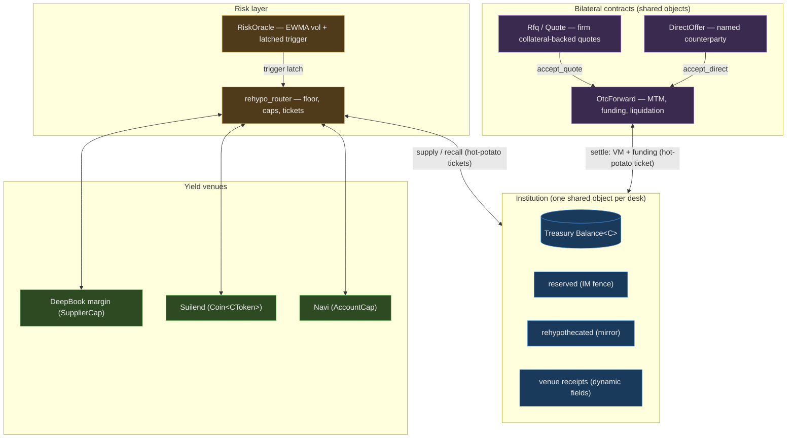
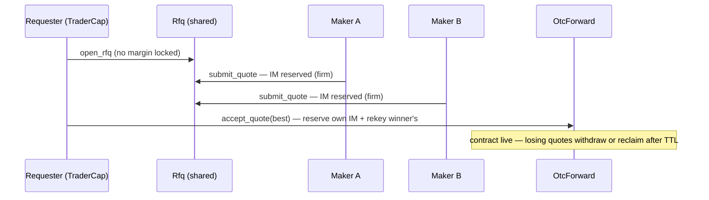
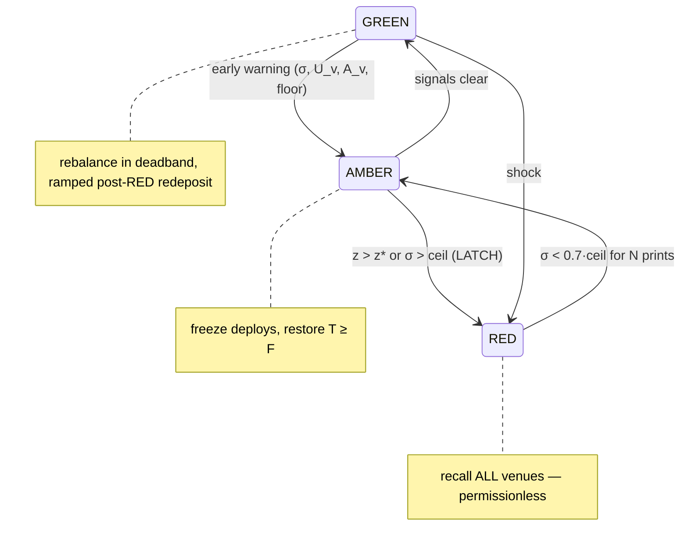

# Fullmetal — Institutional OTC Derivatives with Risk-Responsive Collateral

**A whitepaper covering the protocol design, the mathematics, the codebase as built, and the
path to production.**

Version 0.9 · Sui testnet MVP · companion deep-dives:
[ARCHITECTURE.md](ARCHITECTURE.md) (object model & deployment),
[RISK-RESPONSIVE-REHYPOTHECATION.md](RISK-RESPONSIVE-REHYPOTHECATION.md) (the risk algorithm, fully sourced).

---

## 1. Thesis

OTC derivatives collateral is the largest pool of deliberately idle capital in finance.
Initial margin sits encumbered for the life of a contract; every layer of the
intermediation stack — prime broker, custodian, clearing member, tri-party agent — adds
fees and latency but no yield. The one quantitative rehypothecation rule TradFi ever wrote
down (SEC 15c3-3: re-use capped at 140% of the customer's debit balance) exists precisely
because re-using margin is *valuable*; the 2008 London experience (uncapped re-pledging,
collateral churn ≈ 4×, a $4–5T effective-collateral collapse when the chain unwound —
Singh, IMF WP/10/172, WP/11/256) is why it is *feared*.

Fullmetal's claim: on a chain with shared state and programmable custody, you can have the
value without the fear. Specifically:

1. **One pooled treasury per institution, cross-margined** — initial margin is an
   accounting fence (`reserved`), not a transfer, so one desk's collateral backs all its
   positions simultaneously.
2. **Idle margin earns** — the unfenced surplus is rehypothecated into on-chain lending
   venues (DeepBook margin, Suilend, Navi), held as receipts custodied *by the
   institution object itself*.
3. **Risk response is a permissionless on-chain control loop** — a volatility trigger
   latches and *anyone* can crank the recall; collateral auto-deleverages back to liquid
   without trusting an operator to act.
4. **Collateral velocity is capped at 1 by construction** — receipts are never
   re-pledged. The 2008 failure mode is excluded by the type system, not by a covenant.

Settlement asset: USDC (6 dp). Chain: Sui — chosen for object-capability custody
(receipts inside shared objects), programmable transaction blocks (atomic multi-protocol
composition), and zkLogin (institutional onboarding without seed phrases).

---

## 2. System overview



Twelve Move modules in one package (`fullmetal`), Move 2024, deployed on Sui testnet with
DeepBook margin as the live venue; Suilend and Navi integrations are validated against
mainnet (§8). A Next.js front end drives the whole loop gaslessly via Enoki-sponsored
zkLogin transactions.

| Module | Role |
|---|---|
| `institution` | the tenant: pooled treasury, margin fences, traders, admins |
| `otc_forward` | the bilateral contract: MTM settlement, funding, liquidation |
| `settlement` | atomic inter-institution value transfer (hot potato) |
| `rfq`, `direct` | price formation: competitive quotes / named-counterparty offers |
| `oracle` | keeper-pushed marks + EWMA volatility trigger with hysteresis |
| `rehypo` | DeepBook-linked rehypothecation (testnet live path) |
| `rehypo_router` | venue-agnostic rehypothecation core: config, floor, tickets |
| `protocol`, `registry` | witness allowlist governance; handle → institution identity |
| `errors`, `events` | canonical abort codes; BCS-stable indexer event schema |

---

## 3. The Institution: one pool, four numbers

Everything the protocol does reduces to maintaining invariants over four quantities on
the `Institution<C>` shared object:

| | Meaning | Source |
|---|---|---|
| $T$ | physically-liquid treasury | `balance::value(&treasury)` |
| $R$ | reserved initial margin = Σ open `ContractRef.im_reserved` | `reserved` |
| $Y$ | principal out earning at venues | `rehypothecated` (mirror) |
| $M$ | Σ maintenance requirements (cross-margin denominator) | `total_required` |

Derived:

$$E = T + Y \quad\text{(equity)}\qquad
A = \max(0,\, E - R) \quad\text{(economically free)}$$

**The two withdrawal gates.** `withdraw_treasury` requires *both* `amount ≤ A` (never
break the IM fence — economic) *and* `amount ≤ T` (you can't hand out money that is out
earning — physical). The gap between the two is exactly the "recall first" state: funds
that are yours and free but deployed.

**Cross-margin is the fence, not a transfer.** `reserve_margin` moves no coins — it
increments $R$ and the trader's `deployed`, checks trader book-size headroom
(`deployed + im ≤ book_size`) and firm liquidity (`im ≤ A`), and records a
`ContractRef` keyed by contract id. One pool backs every position; a desk's margin
requirement nets across its book by construction. Release reverses it. Both are gated by
a **witness allowlist** (§4) so only audited contract modules can touch the fence.

**Authority is object-capability, three tiers:**

- `ProtocolCap` — platform: governs only the witness allowlist (which contract modules
  may move margin). Never touches tenant funds.
- `AdminCap` (per institution, multi-admin with two-step transfer, epoch mass-revoke) —
  treasury deposit/withdraw, trader management, pause, rehypothecation policy.
- `TraderCap` (per trader, book-size-bounded, revocable individually or en-masse via
  `cap_epoch`) — open contracts within their book.

A revoked cap object still exists in its holder's wallet; every entry point re-validates
against the live sets on the institution — possession is necessary, never sufficient.

---

## 4. The bilateral contract: forward/perp mathematics

`OtcForward<C>` is one shared object per negotiated contract — not an order-book row.
Forwards and perpetuals are the same object: `expiry_ms = 0` is a perp; funding is a
fixed per-interval rate with a direction flag (forward-perp hybrids = nonzero expiry +
nonzero funding).

**Scaling.** Prices and quantities are 1e6 fixed-point; collateral is 6 dp. Signed PnL is
computed in OpenZeppelin SD29x9 (9 dp signed decimal); products route through
`u128 mul_div` with explicit rounding and an overflow assert (no silent truncation).

**PnL** (long-side, from mark $p_0$ to $p_1$, quantity $q$; all 1e6):

$$\text{pnl} = (p_1 - p_0)\cdot q \quad\text{in SD29x9},\qquad
\text{magnitude}_{6dp} = |\text{pnl}|/10^3,\quad \text{long gains} \iff p_1 \ge p_0$$

**Per-interval settlement** (`settle`, permissionless, cadence-gated by
`settlement_interval_ms`): the keeper marks against the oracle price and the contract
nets variation margin against funding *before* anything moves:

$$\text{VM} = \text{pnl}(m_{prev} \to m_t),\qquad
\text{funding} = \Big\lceil \tfrac{N_{6dp}\cdot f_{bps}}{10^4} \Big\rceil$$

where $m_{prev}$ is the mark at the previous settlement, $m_t$ the current oracle mark,
$N_{6dp}$ the cached USD notional, and $f_{bps}$ the fixed per-interval funding rate.
Credits and debits accumulate on the long side and only the net difference transfers —
one transfer per interval, loser → winner, via the settlement hot potato.

**The settlement hot potato.** `settlement::begin_settlement` debits the payer's *free*
funds (`amount ≤ A` — reserved IM is never spendable by a counterparty claim) into a
`SettlementTicket` with **no abilities**: it cannot be stored, copied, or dropped, so the
same transaction must deliver it to `finish_settlement`, which asserts the payee identity
and joins the funds. Failure anywhere aborts the whole PTB — a payer shortfall *is* the
liquidation signal.

**Margin levels.**

$$\text{IM}_{each} \ \text{negotiated}\ (\text{UI floor: } \max(\$1,\ 5\%\cdot\text{notional}) \Rightarrow \le 20\times),\qquad
\text{MM}_{each} = \lfloor 0.70\cdot \text{IM}_{each}\rfloor$$

**Liquidation** (as built): if the loser's $A$ cannot cover the interval's net,
`final_settle` releases both IM fences and pays
$\min(\text{owed}, A_{loser})$ to the winner — terminal status `LIQUIDATED`. Honest
limitation, flagged in §9: maintenance margin is *recorded* but not yet *enforced* — a
position can sit below MM between intervals without being liquidatable. Production
requires an MM-breach liquidation path (`equity-vs-M` check crankable any time), making
`total_required` load-bearing.

---

## 5. Price formation: Direct offers and RFQ

Two paths to the same contract object, sharing one margin seam:

- **Direct**: proposer fixes all terms including price, reserves IM immediately under
  `RfqWitness`, names exactly one counterparty institution; that counterparty's trader
  accepts unilaterally (proposer never re-signs — their reservation is *re-keyed*
  atomically onto the new contract). TTL + permissionless reclaim bound the capital
  lockup.
- **RFQ**: requester posts intent (no margin), targeted (VecSet of maker institutions) or
  broadcast. Makers submit **firm, collateral-backed quotes** — each `submit_quote`
  reserves the maker's IM at quote time, keyed by quote id. Requester accepts one;
  `open_from_rfq` reserves the requester leg live, re-keys the winning maker's
  reservation, and shares the forward — maker co-signature not required, **no last
  look** by construction.



The firmness design is the differentiator: in TradFi and in Paradigm-style crypto RFQ,
quote firmness is reputational; here it is **IM-reserved on-chain with no last look** —
a quote *is* a posted bond.

### 5.1 Information leakage — what we hide, and how

Today, nothing is hidden: `Rfq` and every `Quote` are shared objects, and the event
stream re-emits the payload. A rival desk reads, in the clear and in real time:
requester and maker institution ids (de-anonymizable to handles via the registry),
trader addresses, **direction** (`requester_side`), underlying, **notional**, tenor, the
requester's **limit band** (`min_price`/`max_price`), and **every maker's live quoted
price with identity attached** — then the winner and winning price at fill. The leak
costs are the classic ones: front-running the winner's delta hedge, fading a known
desk's flow, tick-undercutting rivals (quote → watch → withdraw → requote), and mining
each desk's pricing curve over time.

The empirical discipline from RFQ markets: leakage grows with every dealer pinged —
on SEF index-CDS, customers ping only ~4 dealers though dozens are available, and dealer
response rates *fall* as panels widen (Riggs–Onur–Reiffen–Zhu, JFE); direction
concealment via **two-way quoting** (Tradeweb RFM: "nobody knows the side traded, or if
a trade happened") is standard practice; Paradigm's crypto MDRFQ runs ~75% anonymous
two-way. Off-chain-quote/on-chain-settle (Hashflow, 1inch) removes pre-trade leakage
entirely at the cost of a liveness-trusted quoting service.

**The design, phased** (full matrix in the analysis; summary):

| Information | Phase A (Move + UI only) | Phase B (Seal + Walrus) |
|---|---|---|
| **Direction** | **eliminated**: drop `requester_side`; makers quote **bid AND ask**; side chosen only inside `accept_quote`; events carry neither | — |
| **Quote prices** | single-shot firm quotes (no withdraw-and-requote), short simultaneous window | **sealed bids**: price ciphertext under Seal threshold encryption; policy = "requester, or anyone after t_close"; the winning quote decrypts **on-chain** in `accept_quote` (`seal::bf_hmac_encryption`); losers never revealed |
| Requester identity | ephemeral per-RFQ addresses (zkLogin/Enoki already sponsors); events stripped to ids-only | reveal-to-winner at accept |
| Notional | size buckets in object + events; exact size fixed at accept | exact size sealed to targeted makers |
| Limit band | never on-chain (client-side only — today's UI already sends 0/0) | sealed |
| Dealer panel | default UI to 3–5 targeted makers (the `targets` set exists); broadcast becomes the exception | policy-gated RFQ visibility per maker institution |
| Winner / post-trade | plaintext (bilateral credit + keeper marking need it) | Phase C: sealed terms + margin attestations, after the keeper path is redesigned |

A detail that makes sealed bids unusually clean here: commit-reveal's classic failure
(non-reveal griefing) is normally patched with deposits — **our quotes already post IM
at submit time**. The deposit exists; only the encryption is missing.

---

## 6. The risk layer: trigger, floor, router

Full derivation with primary sources in
[RISK-RESPONSIVE-REHYPOTHECATION.md](RISK-RESPONSIVE-REHYPOTHECATION.md). The
implemented core:

**Volatility estimator + latch** (`oracle.move`, live in this build). EWMA variance —
the GARCH(1,1) family (Chaos Labs models crypto log-prices as GARCH(1,1); RiskMetrics
λ = 0.94) reduced to one integer multiply-add per print:

$$\sigma_t^2 = \lambda\sigma_{t-1}^2 + (1-\lambda)r_t^2$$

Two latch conditions (a shock and a regime rule — the BoE tool study shows level
controls and shock controls fail in different dimensions, so both):

$$z_t = |r_t|/\sigma_{t-1} > z^{*} \;(=4) \qquad\text{or}\qquad \sigma_t > \sigma^{ceil}$$

Release is asymmetric (EMIR Art. 28's "avoid disruptive or big step changes"):
$\sigma < 0.7\,\sigma^{ceil}$ **and** $N{=}3$ consecutive in-band prints; any
out-of-band print resets the counter. A pleasing emergent property, captured in the test
suite: a *larger* shock leaves σ above the release band longer, so cool-down extends
automatically — no extra rule needed.

**The liquidity floor** (`rehypo_router`, live in this build). The single invariant:

$$T \;\ge\; F \;=\; \max\big(O_{stress},\; 0.25\cdot R\big)$$

Basel's LCR shape (coverage ratio, usable in stress), with the 25% unconditional floor
being both EMIR's buffer quantum and the consequence of the LCR's 75% inflow cap. The
keeper estimates $O_{stress}$ off-chain (quantile-over-recall-horizon
$\Phi^{-1}(0.99)\,\sigma\sqrt{t_{recall}}$ — SIMM's own calibration with venue recall
latency substituted for the regulatory MPOR — floored by the worst realized historical
flow) and pushes it; **the chain enforces the floor** as an assert inside
`withdraw_for_rehypo`. An adversarial keeper can propose a suboptimal allocation, never
an unsafe one.

**The router** (`rehypo_router`, live). Venue-agnostic: admin-tunable
`RehypoConfig` (IM/MM bps, recall trigger, floor, per-venue enable/cap/weight — all in a
dynamic field, no struct migration), per-venue receipt + principal slots, and two
**hot-potato ticket pairs** making supply and recall atomic across packages:

```
supply:  (coin, ticket) = withdraw_for_rehypo(inst, cap, venue, amt)   // floor + cap asserts
         receipt        = <venue adapter>::supply(coin, …)             // typed venue call
         confirm_rehypo(inst, ticket, Some(receipt))                    // store + note_supplied
recall:  (receipt, t2)  = begin_recall<R>(inst, cap, venue)
         coin            = <venue adapter>::recall(receipt, …)
         finish_recall(inst, t2, coin)                                  // rejoin + note_recalled
```

Tickets have no `drop`: a PTB that debits the treasury and fails to complete the deposit
aborts entirely. Interest above principal realizes into equity at recall.

**Allocation policy** (keeper-side, spec'd): greedy risk-adjusted yield
$y_v - \lambda\, RW_v\, CR_v$ under three caps — SIMM's concentration penalty
$CR_v = \max(1, \sqrt{P_v/(\beta A_v)})$ (superlinear once our position exceeds half the
venue's withdrawable cash), a hard exit cap $P_v \le 0.25\,A_v$, and Basel-style tier
composition limits — rolled up with SIMM's correlation formula at ψ = 0.8 (three venues
on one chain share liveness, USDC, and Pyth: yield diversification, not tail-risk
diversification).



Why the hard exit cap is non-negotiable — the measured record: Aave USDT went
77.4% → ~100% utilization in ten hours and pinned **above 99% for 135 consecutive
hours** (Apr 2026); during the Curve episode, repayments were withdrawn by queued
suppliers *instantly*, holding utilization at 100% while Fraxlend's controller doubled
the rate every 12 hours. At $U = 1$, supplier recall is not slow — it is
first-come-first-served against repayments. Exit liquidity is controlled at entry.

---

## 7. Venue integration layer

The empirical finding that shaped the architecture: **there is exactly one Pyth and one
Wormhole deployment on Sui** — DeepBook links the official source, Suilend and Navi link
their own *mirrors* of the same audited package (identical `published-at`
`0x04e20ddf…`, identical addresses). The "fork conflict" is a source-graph naming
problem, solvable with a single `override`; a package linking DeepBook + Suilend
type-safely **builds** (proven with `sui move build`, concrete types from both in one
module). Navi alone cannot be Move-linked: its published interface repo pins two package
names to one id (`math`/`utils` → `0x66aa3335`, actually an old v20 of their monolith) —
unresolvable by override — and its runtime package id churns behind a version guard.

Hence the shape: **venue-free core + typed adapters where linking is clean (DeepBook
live; Suilend buildable) + PTB adapter where it isn't (Navi)** — all three arriving at
the same dynamic-field receipt slots through the same tickets.

What was validated, all against **live mainnet state** under `dryRunTransactionBlock`
(which, unlike devInspect, enforces function visibility and gas — a distinction that
caught a real bug: Navi's `account::create_account_cap` is friend-only and passes
devInspect while the real public path is `lending::create_account`):

| | DeepBook margin | Suilend | Navi |
|---|---|---|---|
| Receipt | `SupplierCap` (reused) | `Coin<CToken>` (consumed) | `AccountCap` (reused) |
| Proof | full loop live on testnet (demo) | supply→redeem, one PTB, net −0.000001 USDC | oracle-refresh→create→deposit→withdraw, one PTB |
| Recall gate | share rounding only | protocol-wide **outflow rate limiter** | **oracle freshness**: 15 s window on-chain, keepers push ~minutes ⇒ withdraw must carry its own Pyth update |
| Churn | low (MVR) | moderate (call current pkg, types on original) | high — current pkg id fetched from Navi's API |

The gates price directly into the §6 buffer as $\sqrt{t_{recall}}$: a venue whose exit
can be throttled or oracle-gated is *quantitatively* more expensive to hold, not
qualitatively "riskier." The adapter interface each venue implements:

```ts
interface VenueRiskAdapter {
  position(): u64;          // P_v — principal + accrued
  withdrawable(): u64;      // A_v — max one-tx recall NOW
  utilization(): number;    // U_v + the rate-model kink U*_v
  supplyApr(): number;      // live, from the on-chain interest model
  recallLatency(): Profile; // t_v + what gates it
  structuralScore(): Tier;
}
```

`/api/rates` already serves `apr`, `utilization`, `availableUsdc`, `kinkPct` for all
three venues from their on-chain models — the adapter read-path is live.

---

## 8. What is proven today

- **On-chain (testnet, live demo):** institution creation → deposit → direct + RFQ
  contract opening → interval settlement → rehypothecate → oracle spike →
  permissionless trigger recall → auto-redeposit. Gasless via Enoki/zkLogin.
- **Unit tests: 21/21** — lifecycle, RFQ/direct/OTC economics, and the risk layer (the
  full EWMA shock→latch→release trace with hand-computed variance values, counter reset
  on re-shock, regime latch with no single large print, floor blocking at the exact
  boundary, ticket round-trip accounting with interest realizing into equity, venue-cap
  enforcement).
- **Mainnet validations:** Suilend and Navi full supply+recall round-trips (above);
  live APR/utilization/liquidity reads for all three venues.
- **Research-verified math:** every formula and parameter anchor in the risk layer
  traces to a primary source (ISDA SIMM v2.4, BIS bcbs238, EMIR 153/2013 Art. 28, BoE
  SWP 597, Chicago Fed, Gauntlet's and Chaos Labs' own methodology documents) —
  adversarially verified; see the risk doc's §9 source table.

## 9. Production-readiness: the honest gap list

From a full-repo audit sweep (contracts, frontend, scripts, ops). The four
load-bearing items:

1. **The oracle is the economic trust anchor and it is one key.** `push_price` accepts
   any u64 from a single `KeeperCap`; `settle` reads it with no staleness or deviation
   guard. Production: Pyth as the primary mark source (the dependency already exists
   transitively) with staleness + deviation-band asserts; the keeper oracle stays as the
   EWMA/trigger layer over it; multiple keepers.
2. **Key concentration.** Publisher key currently holds ProtocolCap + OracleAdminCap +
   KeeperCap + UpgradeCap (+ the demo maker desks and server routes). Production: split
   per-capability keys, multisig ProtocolCap/UpgradeCap, timelocked upgrades and witness
   allowlisting, per-tenant AdminCap m-of-n.
3. **Maintenance margin must become load-bearing.** Today liquidation only fires when an
   interval's net exceeds the loser's free funds; `maintenance_each`/`total_required`
   are recorded but unenforced. Production: a permissionless MM-breach liquidation crank
   (equity vs $M$), with a liquidation incentive to make cranking self-funding.
4. **Receipt provenance.** `confirm_rehypo<R: store>` trusts the adapter's receipt.
   Production: allowlist adapter witnesses exactly like OTC witnesses (the mechanism
   already exists in `protocol.move`), so only audited adapters can confirm; typed
   adapters (DeepBook, Suilend) additionally get compile-time receipt checks.

The rest, prioritized: **High** — keeper/cranker daemon with failover and gas management
(settlement liveness is currently a volunteer); pause coverage extended to
rehypo/router/settle-entry; permissionless `create_institution` gating + handle-squatting
policy. **Medium** — RPC failover; CI + reproducible deploys (toolchain pinned; no
`.github/` today); real maker network (replace `/api/makers`); institution membership
binding for zkLogin identities (localStorage is display-only today); rate
limits on faucet/sponsor routes; security headers; events for router policy changes.
**Low** — rounding-dust property tests; upgrade-compat tests; frontend e2e; mainnet
config split. Plus the institutional table stakes: third-party audit, key ceremony,
incident-response runbook, oracle attestation.

None of these are research problems; they are engineering weeks. The two that change
protocol *shape* are (3) — one new crankable entry point — and Phase A of the RFQ
privacy design (§5.1), which is a field-level change to `rfq.move`.

## 10. Visualization plan

Two surfaces, both fed by data that already exists (events are BCS-stable and
indexer-ready; `/api/rates` serves the venue reads):

**A. Risk console (per institution — extends the dashboard).**
1. *Treasury waterfall*: $T$, $R$, $Y$, $F$, $A$ as a stacked live bar — the §3
   invariants made visible; floor breach = the bar goes red.
2. *σ-trace*: EWMA σ per underlying vs its ceiling and release band, with latch/release
   markers and the GREEN/AMBER/RED state strip — the §6 state machine as a timeline
   (data: `VolUpdated` events).
3. *Venue panel*: per venue — $U_v$ against its kink, $A_v$ vs our $P_v$ (the exit-cap
   ratio as a gauge), live APR, recall-gate status (Suilend limiter / Navi oracle age).
4. *Contract blotter upgrade*: per-position MM headroom (equity vs `maintenance_each`)
   and time-to-next-settlement.

**B. Protocol observatory (public).** Aggregate rehypothecated TVL by venue, trigger
history, settlement/liquidation feed from events, RFQ market stats (open RFQs, fill
rates, spread distributions — bucketed per §5.1 so the observatory itself doesn't leak).

Implementation: a small indexer (Sui checkpoint subscription → SQLite/Postgres) over the
existing event schema; charts in the existing Next.js app. The demo's mock sections
retire naturally as these fill in.

## 11. Backtest plan

Goal: calibrate $(\lambda, z^{*}, \sigma^{ceil}, \theta_{rel}, N, \varphi, \alpha_{max})$
and *prove* the control loop dominates both "never rehypothecate" and "always
rehypothecate" on real stress paths.

1. **Data.** (a) Underlying marks: crypto minute/hourly series (BTC/ETH/SOL as SPCX
   proxies) spanning the stress windows — Nov 2022, Mar 2023, Jul 2023, Apr 2026;
   (b) venue states: historical utilization/available-liquidity for Aave USDC/USDT as
   the venue-liquidity proxy (the 135-hour pin is in-sample!), plus our three venues'
   current on-chain reads going forward (start recording now via `/api/rates` — a cron
   writing snapshots gives us our own venue history within weeks).
2. **Simulator.** Deterministic replay: price series → EWMA/latch state machine →
   floor $F_t$ → deploy/recall decisions under venue-liquidity constraints (recall
   fills $\min(\text{requested}, A_v(t))$ per step — the Solend/Curve mechanics) →
   treasury trajectory. Pure TypeScript, reusing the exact integer EWMA arithmetic from
   `oracle.move` so the backtest and the chain compute identical σ (the Move test
   vectors become the simulator's unit tests).
3. **Metrics.** (a) *Safety*: hours of floor breach; worst liquidity shortfall vs a
   simulated margin-call schedule; recall completion time per stress event.
   (b) *Yield*: net APR captured vs always-deployed ceiling. (c) *Stability*:
   trigger count, false-latch rate, recall-redeposit churn (deadband effectiveness) —
   BoE's two procyclicality metrics (peak-to-trough, n-day) applied to our deployment
   series. (d) Parameter frontier: sweep $z^{*}\!\times\!\sigma^{ceil}\!\times\!\varphi$,
   plot safety-vs-yield Pareto, pick the knee.
4. **Adversarial scenarios** (Chaos-style): synthetic paths — GARCH(1,1)-fitted with
   jump injection; venue liquidity forced to the 135-hour-pin profile during the jump;
   oracle keeper outage during RED. Pass criterion: the floor holds without manual
   intervention in ≥ 99% of paths (the same quantile the margin math is built on).

Deliverables: `scripts/backtest/` (replayer + scenario configs), a `BACKTEST.md` results
note with the Pareto plots, and the chosen parameter set written into `RehypoConfig`
defaults.

## 12. Roadmap

| Phase | Contents |
|---|---|
| **A — protocol hardening** | MM-breach liquidation crank; Pyth marks + guards; RFQ Phase A (two-way quotes, single-shot, size buckets, targeted-by-default); adapter witness allowlist; keeper daemon; key split/multisig |
| **B — risk automation** | keeper allocation optimizer over the venue adapters; backtest-calibrated parameters; venue history recorder; risk console |
| **C — privacy** | Seal sealed-bid RFQ (on-chain winner decryption); encrypted activity/decision logs to Walrus for auditors + parent institutions; ephemeral requester identities |
| **D — scale** | real maker network; institution membership binding; cross-margin across derivative types (options next to forwards/perps in the same pool — the $M$ aggregation is already SIMM-shaped); AI venue-risk monitor |

---

*Repository: `contracts/` (Move package), `frontend/` (demo app), `scripts/` (deploy +
venue validations + backtest harness). Demo: [demo.fullmetal.finance](https://demo.fullmetal.finance).*
